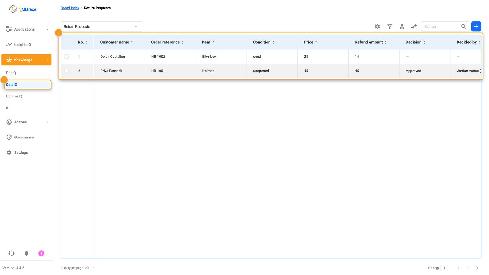
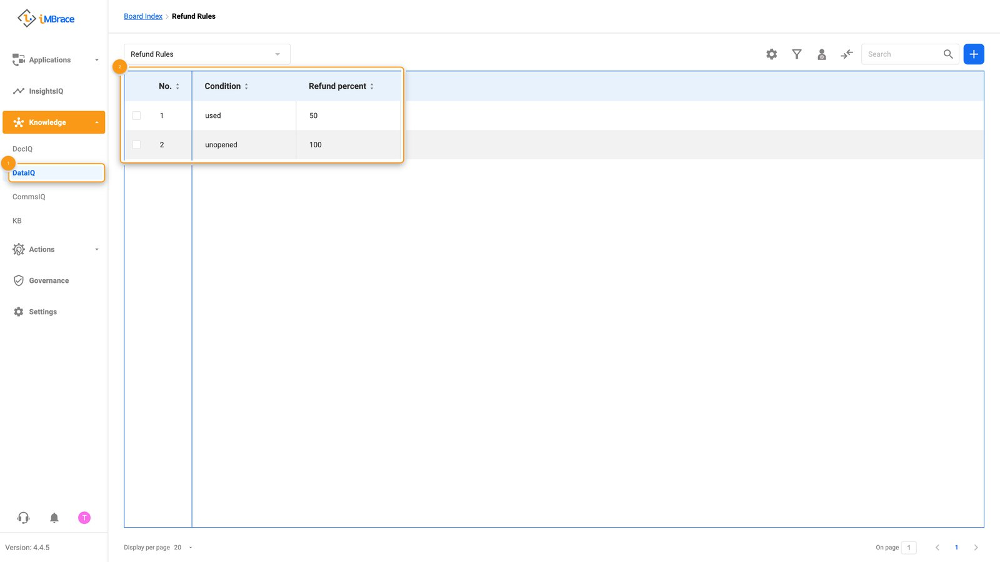
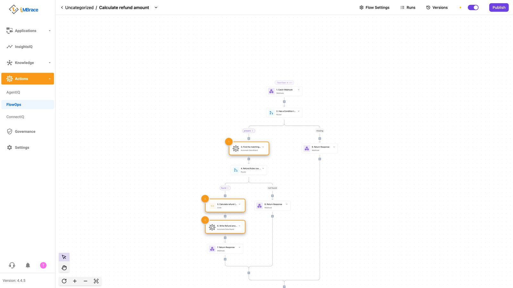
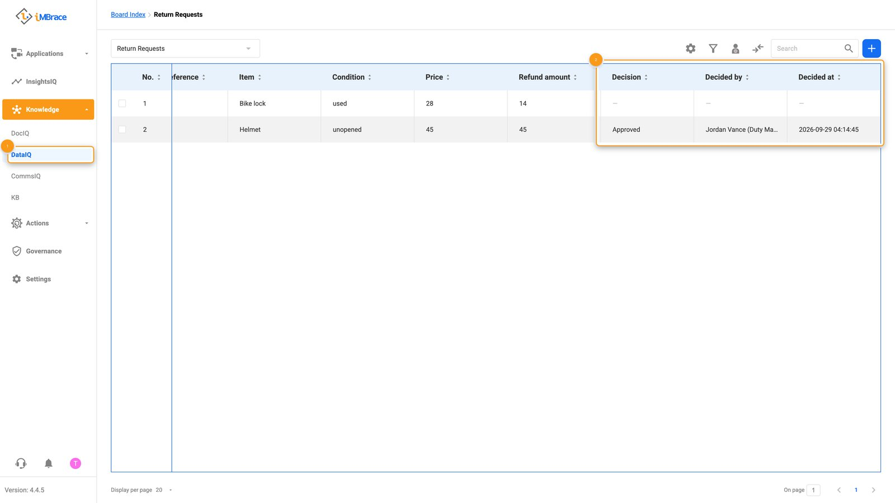
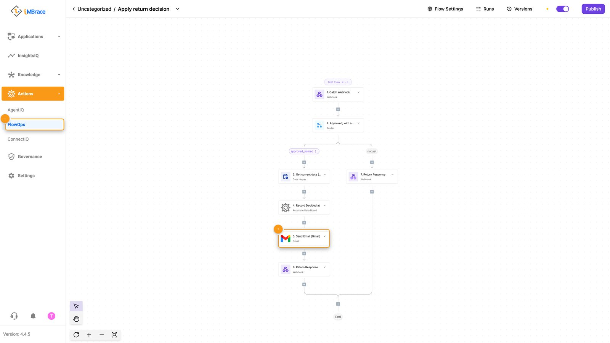
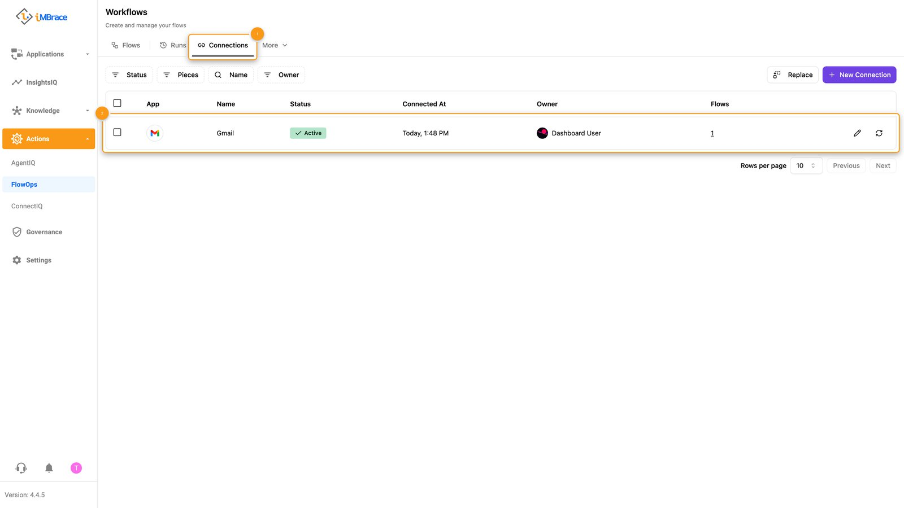
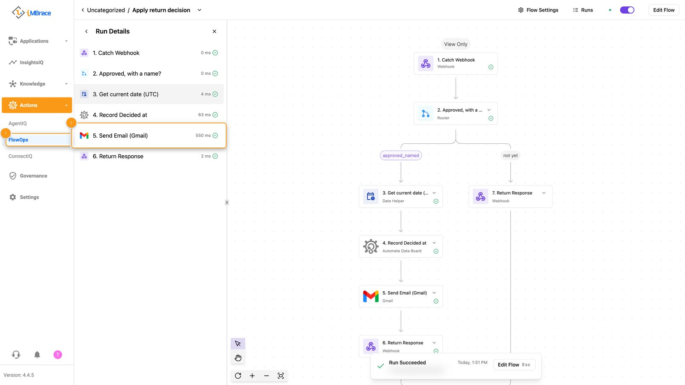
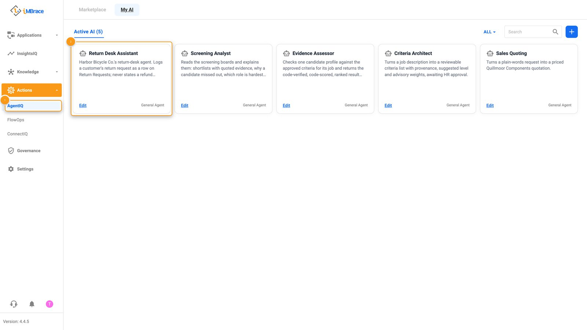
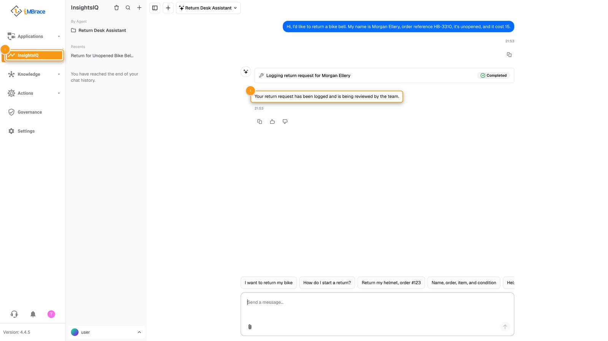

This is Level 2 of the course: Build it. Earlier levels show a use case working end
to end; this page has you build one yourself.

By the end you will have a small agent running on your own test organisation. It is
small on purpose. The point is not the agent - it is five habits that make anything you
build on iMBrace easy to trust, which Level 3 (Build it well) then covers in depth.

## What you will build

Imagine a fictional company, Harbor Bicycle Co., that sells and services bicycles online.
You are building their return-desk agent. A customer writes in asking to return an item.
The agent should:

1. Log the request as a row on a board, instead of leaving it in a chat transcript.
2. Work out the refund amount from a rule anyone at Harbor could edit, not from the
   model's own arithmetic.
3. Wait for a person to approve the row before anything is promised to the customer.
4. Only after that approval, send the customer a confirmation - using the platform's own
   connection for email, never a credential sitting inside your workflow.

Nothing here is Harbor Bicycle Co.'s real system - it does not exist. Swap the company,
the items and the rule for your own before you show this to anyone.

## What you need

- A test organisation and an API key. If you do not have one yet, the [API key
  guide](https://engineer.imbrace.co/guides/api-key/) shows how to generate one from the
  dashboard. Use a test organisation's key here - never a production one.
- An AI coding tool connected to that organisation over MCP, so it can see your boards and
  workflows directly instead of guessing. This page names no tool; any coding assistant
  that can hold an MCP connection and read a text file works. The [MCP
  guide](https://engineer.imbrace.co/mcp/overview/) has the exact connection steps for
  your tool - do that first, before Step 1 below. If MCP is not enabled on your installation,
  [Getting started](/learn/build-it/getting-started/) shows the SDK route.
- If your tool prefers to write real SDK code rather than call the platform directly, install
  the SDK for your language:

  ```bash
  npm install @imbrace/sdk
  ```

  ```bash
  pip install imbrace
  ```

  Either way, your tool will end up needing two environment variables:
  `IMBRACE_API_KEY` and `IMBRACE_ORGANIZATION_ID`. Keep them in a local `.env` file that
  is never committed anywhere, and never paste a live key into a chat with your coding
  tool if you can hand it the variable name instead.
- About an hour. Most of it is reading what the platform hands back to you, which is the
  habit this whole page is trying to build.

A few words this page uses: a **board** is a structured table you shape yourself - rows and
typed columns, like a lightweight CRM sheet. A **workflow** (also called a flow) is a
sequence of steps that runs on its own once triggered. A **native step** is a ready-made
step the platform ships - nothing to write, nothing to host, no key of your own to manage.
An **agent** is the conversational front end a person or a channel talks to.

## Steps

### 1. Look before you build

Do not open an editor yet. Ask your coding tool what already exists.

**You type**, roughly:

> Before we build anything: what boards already exist in this organisation? And
> search the platform's catalog of native workflow steps for anything related to sending
> an email and reading one.

**You should see**: on a new test organisation, an empty list of boards - that is expected, not a
failure. On an organisation that already holds other work, other boards appear at this first
check instead - that is fine too; once you create yours in Step 2, look for it there by name.
Either way you should also see a short list of native steps for email, likely alongside other
channels you did not ask about. Read the list. This is the habit: find the node the platform
already ships before you consider writing one yourself. A step your tool writes from scratch
costs you a credential to hold and a piece of code to maintain; a native step costs neither.

### 2. Create the board that holds return requests

**You type**:

> Create a board called Return Requests with these columns: Customer name, Order
> reference, Item, Condition, Price, Refund amount, Decision, Decided by, Decided at.

**You should see**: a new board in your organisation with those nine columns and no rows yet.
Open it in the platform and check the column names and types by eye - do not just trust
your tool's summary of what it did.

If your tool says it cannot create anything, its MCP connection is read-only - that is the
default. Add write access as the MCP page describes (a flag on the connection address), and
only ever on a test organisation.

### 3. Add two test rows

Use synthetic data. Never real customer or order information, even in a test organisation.

**You type**:

> Add two rows to Return Requests. Make up obviously fake customer names and order
> references. Row one: an unopened helmet, price 45. Row two: a used bike lock, price 28.
> Leave Refund amount, Decision, Decided by and Decided at blank.

**You should see**: two rows, Condition set to "unopened" and "used", Price filled in, the
last four columns empty.


*1 Knowledge > DataIQ in the sidebar. 2 The Return Requests board's columns and rows.*

### 4. Put the refund rule where a person can change it, not in a sentence

This is the habit that matters most on this page. It would be faster to tell the agent
"refund in full if unopened, half if used" in its instructions. Do not. A rule written into
an agent's instructions cannot be edited by anyone who is not editing the agent, cannot be
quoted back to a customer, and cannot be audited later. A rule that lives as a row can be
all three.

**You type**:

> Create a second board called Refund Rules with two columns, Condition and Refund
> percent. Add two rows: unopened, 100. used, 50.

**You should see**: a two-row, two-column board. Anyone at Harbor Bicycle Co. could open
this and change 50 to 60 without touching a workflow or an agent.


*1 Knowledge > DataIQ in the sidebar. 2 The Refund Rules board's two rows.*

### 5. Build the workflow, and let one small step do the arithmetic

**You type**:

> Build a workflow called Calculate refund amount on the Return Requests board that runs
> when a row is added or changed. It should: read the row's Condition, look up the matching
> row on Refund Rules, multiply
> Price by Refund percent using a plain calculation step, and write the result into Refund
> amount. Use native steps for the board reads and writes. Only the multiplication itself
> should be a step you write, and keep it pure - it takes the two numbers in, returns one
> number out, and touches nothing else. No network call, no credential, inside that step.

**You should see**: a workflow you can open in the platform's own editor and read top to
bottom without opening any code. Most of its steps are native. Exactly one step is the
short calculation your tool wrote, and it is short enough to read in ten seconds. Run it
once by hand if your tool offers a test-run option, and check Refund amount lands at 45
for the unopened helmet and 14 for the used lock.


*1 Find the matching row on Refund Rules (native). 2 Calculate refund - the one step written by hand. 3 Write Refund amount back to the row (native).*

This is the second habit: a model is good at deciding which rule applies and bad at being
trusted to multiply correctly under pressure, silently, every single time. Let a
calculating step do the arithmetic. Ask the model to decide; let code compute.

### 6. Add the approval gate

**You type**:

> Build a second workflow called Apply return decision on Return Requests that runs when the
> Decision column changes. It must do nothing unless Decision is Approved and Decided by
> holds a name; it then records the time in Decided at. A row with no decision, or a decision
> with no name, must go no further.

**You should see**: nothing happens for either row yet - neither has a decision. Open the
board yourself and, on the unopened-helmet row only, set Decision to Approved and put your
name in Decided by. Then press **Save**: a board edit is held until it is saved, and nothing
fires before that. Leave the used-lock row alone. Decided at fills in on the approved row
only.


*1 Knowledge > DataIQ in the sidebar. 2 Decision, Decided by and Decided at columns.*

This is the third habit: a decision is a value written on a row, with who and when, not a
person typing "looks fine" into a chat with the agent. If nobody set Decision, nothing
downstream should move - and after this step, nothing does.

### 7. Send the confirmation the safe way

**You type**:

> Add a Customer email column to Return Requests, then extend the approval workflow: once
> it has recorded the decision, send a short confirmation to that address, naming the
> refund amount, using the platform's own connected email step. Do not put an email
> password or API key anywhere in this workflow - use the organisation's existing
> connection, or set one up first if none exists.

**You should see**: in the workflow, a Send Email (Gmail) step after the step that records
Decided at, on the approved branch only. Approve the unopened-helmet row and press **Save**:
the workflow runs once and the confirmation goes to that row's Customer email, naming the
refund amount. The still-pending row starts no run, so nothing is sent for it.


*1 FlowOps in the sidebar. 2 The Send Email (Gmail) step, after the step that records Decided at, on the approved branch.*

To check the credential, open Actions > FlowOps > More > Connections. The email credential
is there as its own named connection, Gmail, and no step of the workflow holds it. This is
the habit from Step 1 carried all the way through: a credential belongs to the platform's own
connection store, never to a workflow. If you export this workflow later, open the exported
file and confirm no key or password is inside it.


*1 FlowOps > More > Connections. 2 The one connection named Gmail.*

The board itself shows nothing about a sent email. To see it, open the workflow's run
history: the run for the approved row finished, and its Send Email (Gmail) step is marked
succeeded. The recipient's inbox holds the email itself.


*1 FlowOps in the sidebar. 2 The Send Email (Gmail) step of the run, marked succeeded.*

Which email connection to use: a mail-server (SMTP) connection is set up once with the
server's details. A hosted mail service such as Gmail needs a person to sign in to the
provider once, in each organisation. An installation with no internet access uses a
mail-server (SMTP) connection on its own network.

### 8. Create the agent

Agents are created with the SDK's AI agent methods (the site has them) or in the platform's
agent screens, so this step uses one of those. Either way, your tool can write the agent's
instructions.

**You type**:

> First build a workflow called Log return request that the agent can call as a tool. It
> takes Customer name, Order reference, Item, Condition and Price, creates one row on
> Return Requests with only those five values, and writes nothing else. Then create an AI
> agent called Return Desk Assistant and give it that one tool - not the board itself. Its
> job: when a customer describes an item they want to return, log it with the tool and reply
> that their request is being reviewed. It must never state a refund amount and never
> promise anything - a human has not decided yet.


*1 Actions > AgentIQ in the sidebar. 2 The Return Desk Assistant agent's card.*

Why a tool and not the board: an agent given the whole board can write any column on it,
including Decision - it could approve its own request. The tool can only write the five
columns a customer supplies, so the decision stays with a person.

One more habit worth building into the agent's own instructions: Refund Rules is matched by
an exact value, so tell the agent to write Condition using the rule's own two words -
"unopened" or "used" - never the customer's own phrasing or a translation of it. Any board a
natural-language agent writes to, when a workflow looks a row up by exact match, needs the
same care.

**You should see**: chatting to the new agent with something like "I'd like to return
order HB-2044, a helmet, still unopened. My name is Morgan Ellery and it cost 39" produces a
new row on Return Requests with those details filled in, and a reply along the lines of
"your return request has been logged and is being reviewed by the team" - no number, no
promise. If your tool's draft instructions let the agent guess a refund figure itself, that
is worth catching here: send it back and ask for the number to be removed from what the
agent is allowed to say. Then ask it to approve the request itself: it must not be able to,
because nothing in its tool can write Decision.


*1 InsightsIQ in the sidebar. 2 The assistant's reply names no refund figure and makes no promise.*

## How to check it worked

Do not take your coding tool's summary of what it did as proof. A plausible account of a
working build is easy to produce and easy to mistake for a real one - go and look.

- Open Return Requests. Both rows should show a correct Refund amount: 45 and 14.
- Only the row you approved should have a run with a succeeded Send Email (Gmail) step; the
  pending row should have no run at all.
- Open the workflow's run history and read the actual status of each run, not a summary of
  it - a run that is still waiting looks different from one that finished.
- Open Actions > FlowOps > More > Connections and confirm the email credential is a named
  connection, not text inside a step.
- Talk to the Return Desk Assistant with a new, made-up return. Confirm a row appears and
  the agent's reply carries no figure and no promise.
- Ask the assistant to approve a request. Confirm Decision stays empty: the agent has no way
  to write it.
- Now approve the used-lock row too, and confirm its confirmation sends as well - proving
  the gate was real, not decorative.

If any of these do not hold, that is more useful than a build that looked fine and was
not. Fix the one thing that failed and check again.

## What to do next

- Try a second condition - a part returned with a missing box, say - and a second rule row.
  Confirm you can change the refund rate without touching the workflow or the agent.
- Try approving nothing, ever, for a row - confirm the customer never receives a refund
  figure, however long you leave it.
- Read Level 3, Build it well, for the fuller method behind these five habits - it covers
  what makes a build like this one survive being handed to a real customer, not just a
  test organisation.
- For anything about the SDK, the CLI or the MCP connection itself, [engineer.imbrace.co](https://engineer.imbrace.co)
  is the source that stays current - this page will drift before that one does. [Getting
  started](/learn/build-it/getting-started/) has the set-up in full.
