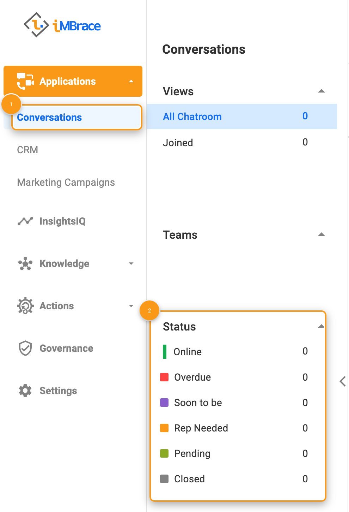
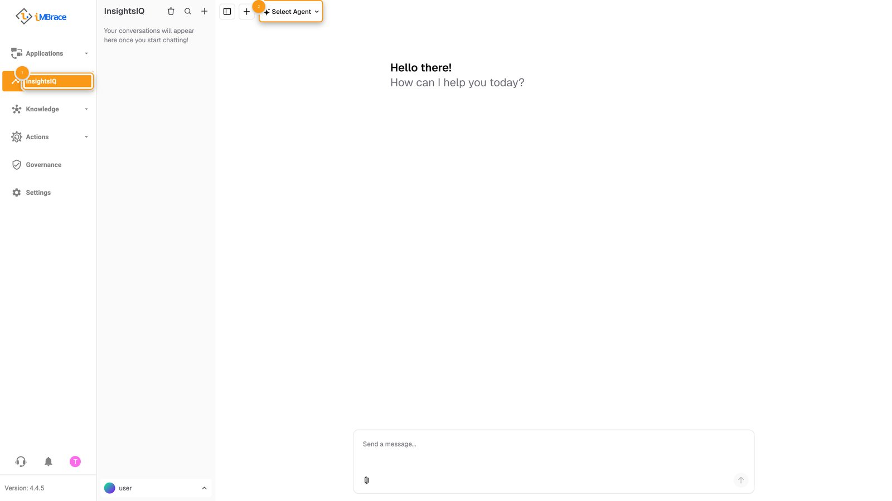
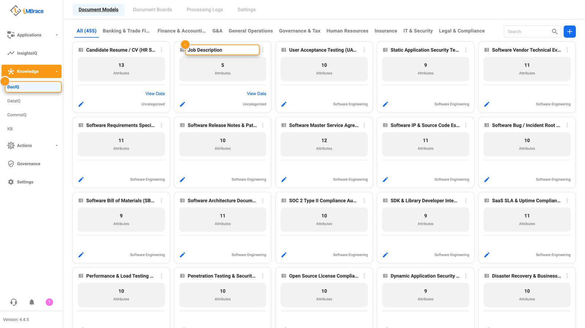
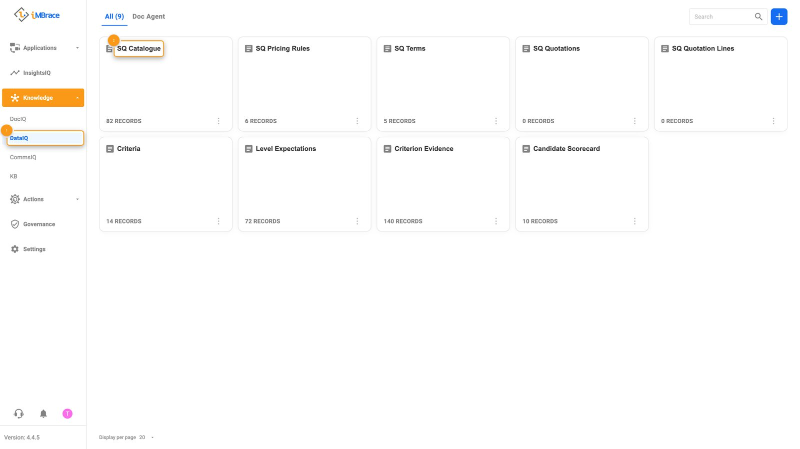
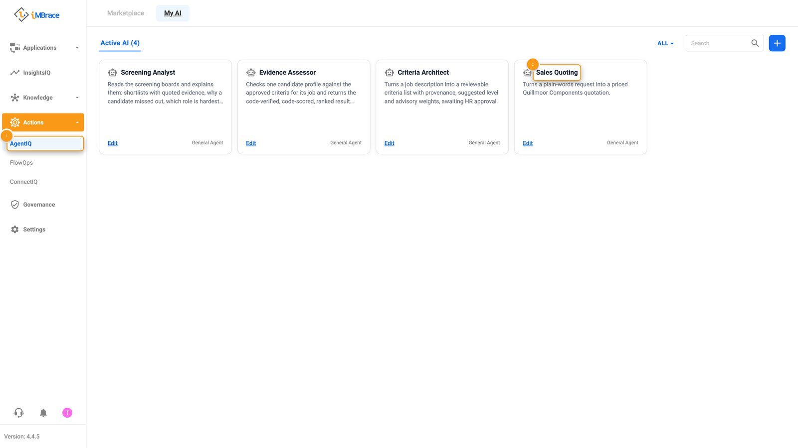
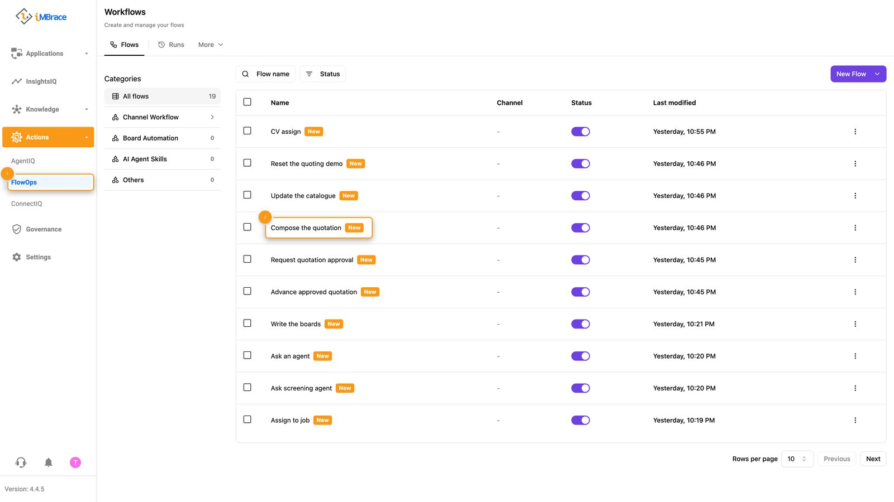
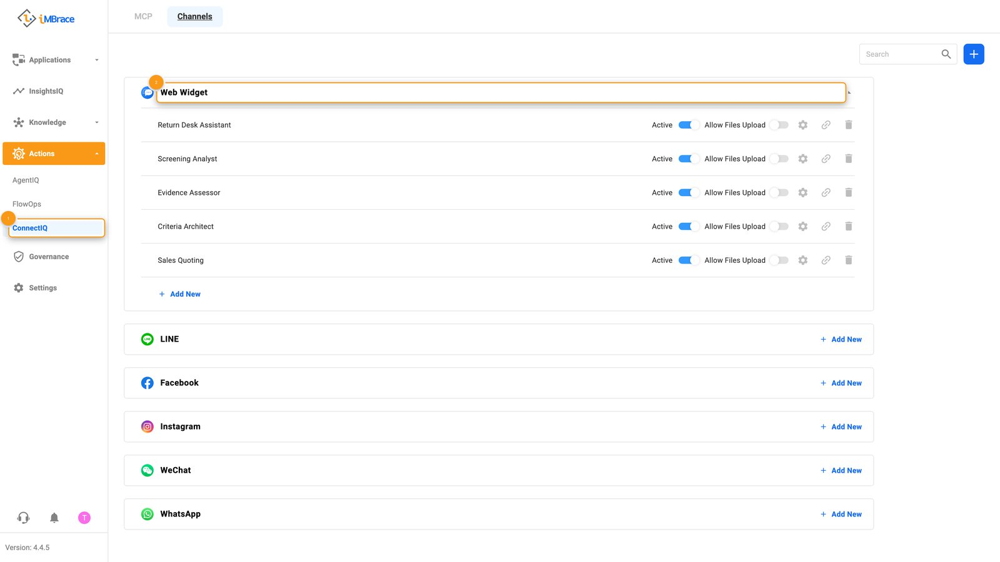
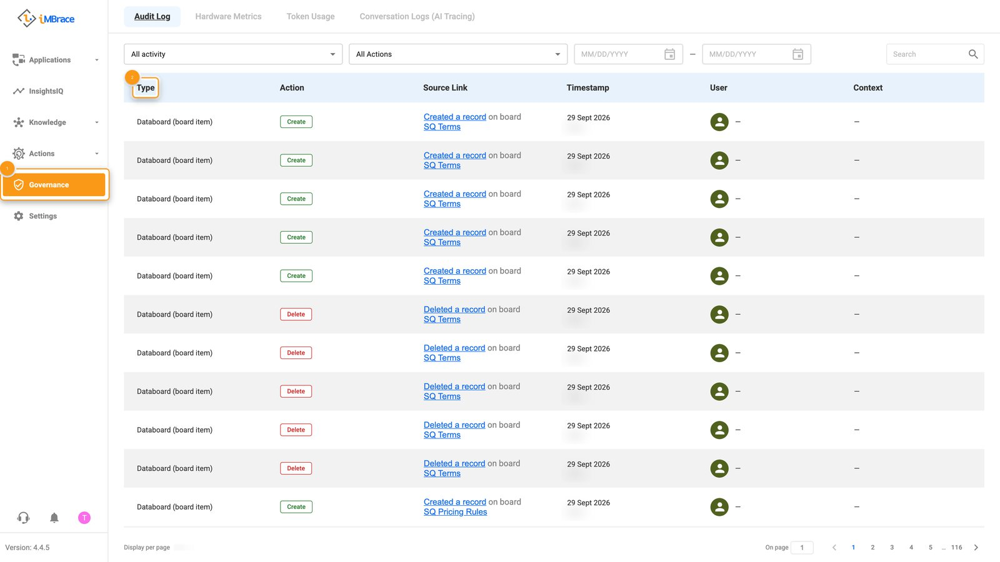
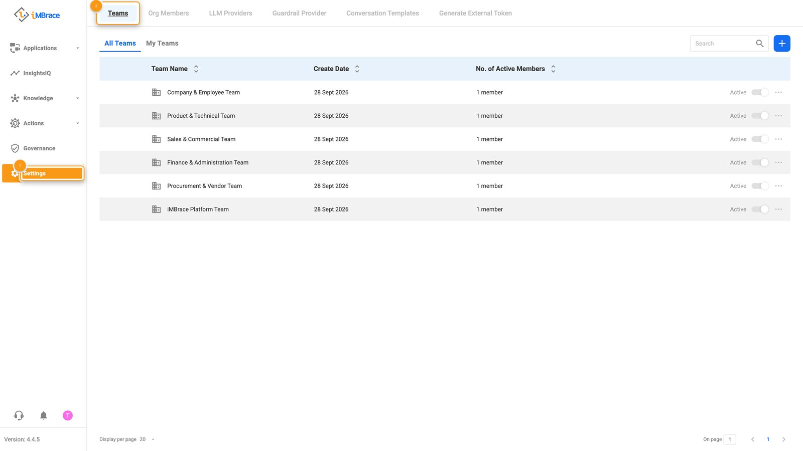

This is the sidebar of an iMBrace organisation, walked in the order it lays out: Applications,
InsightsIQ, Knowledge, Actions, Governance and Settings. Each area gets one short stop - what it
is for, what you see when you open it, and what is worth showing a customer there. Read it once
before your first demo, then keep it open as a checklist while you walk someone else through the
platform.

## Applications

Applications is where a conversation with a customer or a member of staff actually happens. It
opens on Conversations, a shared inbox for every message landing from a connected channel, with
chips to filter by view and by status - online, overdue, rep needed, pending, closed. Whatever
channel a message came in on, it is one list. Show a customer a live conversation arriving, or
filter down to overdue and show that nothing sits unanswered.

*1 Applications > Conversations in the sidebar. 2 The Status filters for the shared inbox.*

## InsightsIQ

InsightsIQ is where you talk to an agent directly and see what it does with a question. It opens
on a chat landing: an agent picker to choose who you are asking, and a composer to ask them. Type
a real question and show the answer arriving, backed by the organisation's own approved
knowledge - and saying so plainly if the answer is not in it. See it in action:
[CV screening, end to end](/learn/see-it-work/cv-screening/) and [Sales quoting](/learn/see-it-work/sales-quoting/).

*1 InsightsIQ in the sidebar. 2 The agent picker.*

## Knowledge

Knowledge holds what the organisation knows: the models that read its documents, the boards that
hold its structured records, and the material an agent answers from.

## DocIQ

DocIQ is where a document model turns an unstructured file - an invoice, a form, a CV - into a
structured record. It opens on Document Models, a library already organised by category such as
Finance & Accounting, Human Resources and Sales & Customers, with Document Boards and Processing
Logs alongside it. Open the model that already matches a customer's own paperwork and show what
it pulls out, field by field.

*1 Knowledge > DocIQ in the sidebar. 2 A document model card.*

## DataIQ

DataIQ is where a structured record actually lives: a board, shaped with your own rows and typed
columns. It opens on board tiles, each a card with the board's name and how many records it
holds. Open a board and read a real row straight off the table - the same one a workflow's
steps, an agent's skill, or a document model's extraction all read and write.

*1 Knowledge > DataIQ in the sidebar. 2 A board tile.*

DocIQ's document models and DataIQ's boards are two of
[the five building blocks](/learn/build-it/building-blocks/) every iMBrace build is made from;
Actions, next, holds the other three - agent, workflow and channel.

## CommsIQ

CommsIQ sits alongside DocIQ and DataIQ, on its own All tab.

## KB

KB is where reference material is uploaded straight in - PDF, Word, PowerPoint, Excel, CSV,
video or image files - organised into folders, for an agent to answer from without anyone
retyping it. If a customer's own material is loaded, open its folder and show the agent's answer
quoting straight from it.

## Actions

Actions is where the other three building blocks live: the agent that has the conversation, the
workflow that does the work, and the channel that carries it back and forth.

## AgentIQ

AgentIQ is where an agent gets built and set up. It opens on three tabs - Marketplace, My AI and
Active AI - with Active AI listing every agent already at work, each on its own card: the Sales
Quoting agent's card reads "Turns a plain-words request into a priced Quillmoor Components
quotation." Open an agent's Behavior Settings and scroll to Skills to show exactly which
workflows it is set up to call, each one built and named for a specific job.

*1 Actions > AgentIQ in the sidebar. 2 The Sales Quoting agent's card.*

## FlowOps

FlowOps is where a workflow is built and watched: a sequence of steps that runs on its own once
triggered, reading a board, calculating, waiting on a decision, sending a message. It opens
straight onto the list of workflows already running. Open one and point to the step where it
waits for the right person to decide, then show it picking back up and finishing on its own once
they have. More on where that decision actually gets made:
[Human approval](/learn/build-it-well/human-approval/).

*1 Actions > FlowOps in the sidebar. 2 A workflow row.*

## ConnectIQ

ConnectIQ connects the platform outward, two ways. Its Channels tab lists where a person
actually reaches an agent - a Web Widget (Active, Allow Files Upload), plus rows to add LINE,
Facebook, Instagram, WeChat and WhatsApp. Its MCP tab is the address and key an AI coding tool
connects with to see and build on an organisation directly - the full guide is at
[engineer.imbrace.co/mcp/overview](https://engineer.imbrace.co/mcp/overview/). Show Channels
first, the apps a customer's own customers already use, and keep MCP for a technical audience.

*1 Actions > ConnectIQ in the sidebar. 2 The Web Widget channel.*

## Governance

Governance is the platform's own record of what happened, kept without anyone having to ask for
it. Audit Log, its landing tab, times and attributes activity across the organisation - logins,
file uploads, channel changes, changes to a board - so any of it is checkable afterwards;
Hardware Metrics, Token Usage and Conversation Logs (AI Tracing) sit alongside it. Open Audit Log
and show one real row: what changed, who did it, and when.

*1 Governance in the sidebar. 2 The Audit Log's Type column.*

## Settings

Settings, for a demo, is Teams and Org Members. Teams - All Teams and My Teams - is
where access is organised and a member's role is set within it, a Team Admin next to a
Representative, each seeing only the teams they belong to; Org Members lists who makes up the
organisation. Open Teams and show how a person's access maps to what they actually do.

*1 Settings in the sidebar. 2 The Teams tab.*

That is the guided path through the sidebar - open it once with a customer, and every area
already has something to show them.
