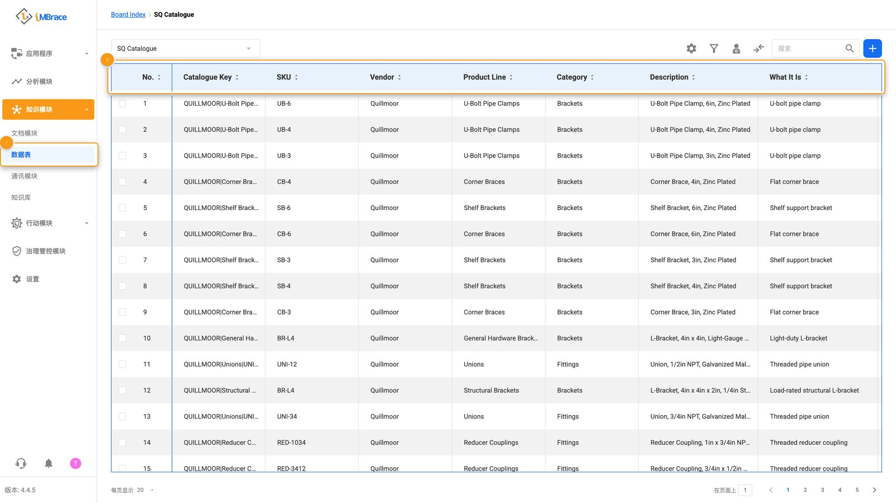
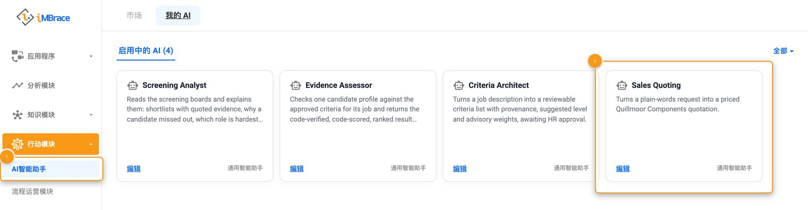
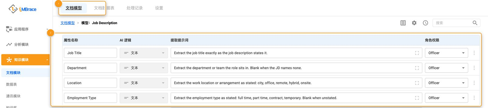
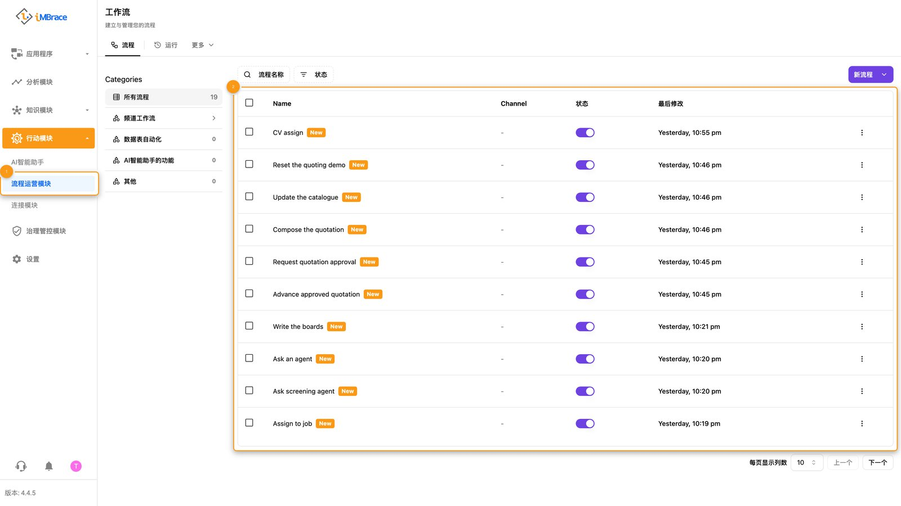
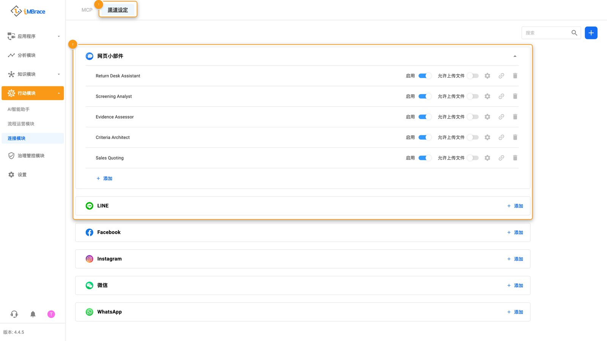
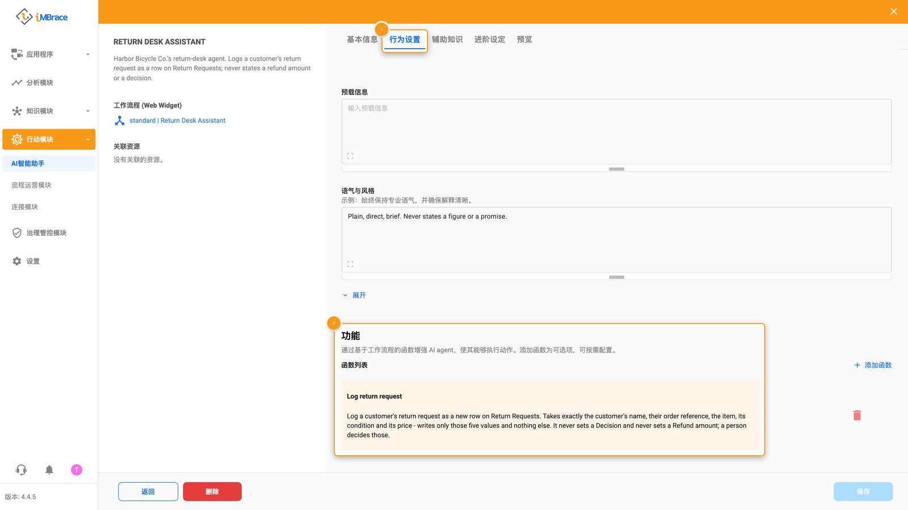
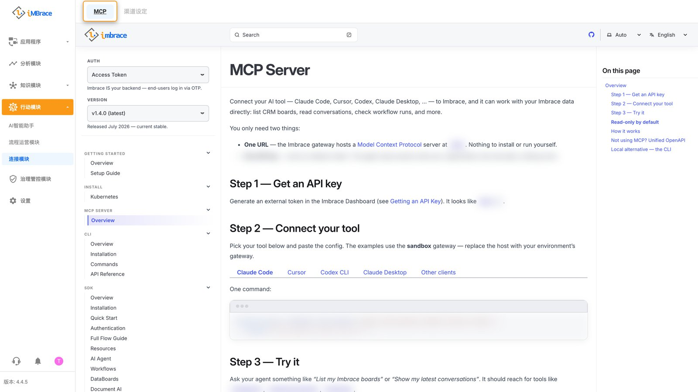
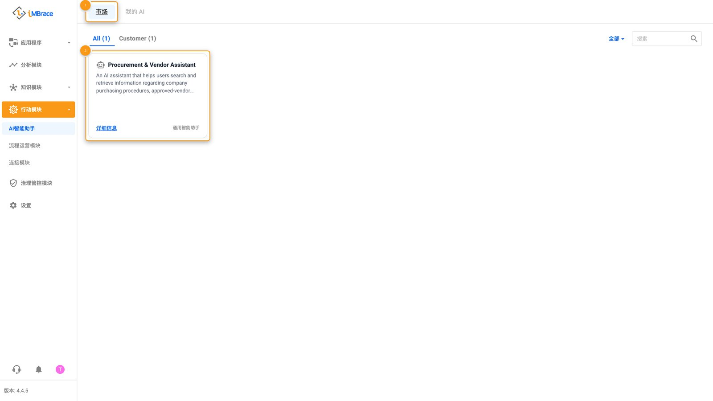

iMBrace 上的每一个用例，不论外观差异有多大，都是用同样的五样东西搭建起来的：一张数据表、一个智能体、一个文档模型、一个工作流程和一个渠道。本页将逐一说明它们的名称、用途，以及它们在产品中的位置，让你第一次打开培训组织时，侧边栏上的一切都不再陌生。最后还会介绍扩展这些部件、或把它们交给别人使用的三种方式：技能、MCP 连接，以及安装模块。

## 数据表

数据表是一张由你自行定义结构的表格——有行，也有按类型定义的字段，就像一张轻量版的 CRM 表格。它用来保存构建工作需要记住的任何内容：一份退货申请清单、一份已报价的报价单、一组可供他人自行编辑的规则。

在侧边栏中，它位于<strong>“知识模块”（Knowledge）>“数据表”（DataIQ）</strong>下（SDK 与其权限范围中称之为 board，或 databoard；产品在屏幕上显示的名称是 DataIQ）。其余每一个构建模块都会读写数据表：工作流程的每一个步骤、智能体唯一可调用的那个精简工具，以及文档模型自身的提取结果，最终都会落在同一张数据表上。

1 “知识模块”（Knowledge）>“数据表”（DataIQ）。2 数据表以行与带类型字段的形式打开。

让数据表值得信赖的习惯：把业务人员可能需要调整的规则——阈值、费率、上限——作为可编辑的行放在数据表上，而不是写死在智能体自己的指令里。[八项原则](/learn/build-it-well/the-eight-principles/) 说明了原因。

用代码实现：[数据表](https://engineer.imbrace.co/zh-cn/reference/board/)。

## 智能体

智能体是用户或渠道所对话的前端。它负责进行对话本身：理解对方在请求什么，并调用正确的工具来完成它。

在侧边栏中，它位于<strong>“行动模块”（Actions）>“AI智能助手”（AgentIQ）</strong>下。用户要通过渠道才能联系到智能体，它的行动方式是调用一个工作流程——也就是它的其中一项技能，下文会介绍——数据表的读写实际上都发生在这一步。

1 “行动模块”（Actions）>“AI智能助手”（AgentIQ）。2 AI智能助手的“启用中的 AI”标签页，每张卡片一个助手。

让智能体值得信赖的习惯：只给它一个专用于某件事的精简工具，绝不给它整张数据表的权限，这样它可以记录一项申请，却永远无法自己写下批准该申请的决定。[人工批准](/learn/build-it-well/human-approval/) 说明了为什么智能体绝不能自己写下那个决定。

用代码实现：[智能体](https://engineer.imbrace.co/zh-cn/reference/ai-agent/)。

## 文档模型

文档模型告诉提取功能要从文件里提取什么内容。它的作用是把一份非结构化的文档——发票、表单、扫描的装箱单——转换成数据表可以保存的结构化字段。

在侧边栏中，它位于“知识模块”下的<strong>“文档模块”（DocIQ）</strong>，在<strong>“文档模型”（Document Models）</strong>标签页中。它提取出的内容会以行的形式落在数据表上，也就是工作流程或智能体随后读取的那张数据表。

1 “文档模块”（DocIQ） > “文档模型”（Document Models）。2 文档模块的“文档模型”标签页，展开其中一个模型的提取字段。

让文档模型值得信赖的习惯：先采用平台自带的默认模型，再考虑另写新模型，并让提取功能对准某一张数据表本身的字段，而不是把模型的选择交给运气。[文档模型](/learn/build-it-well/document-models/) 说明了应该按什么顺序尝试。

用代码实现：[Document AI](https://engineer.imbrace.co/zh-cn/sdk/document-ai/)。

## 工作流程

工作流程（也叫 flow）是一串一旦被触发就会自动运行的步骤。它用来完成实际的工作，并且按固定、可核对的顺序进行：读取数据表、执行计算、等待人工做决定、发送消息。

在侧边栏中，它位于<strong>“行动模块”>“流程运营模块”（FlowOps）</strong>下（SDK 与其权限范围中称之为 workflow；产品在屏幕上显示的名称是 FlowOps）。工作流程会读写数据表，可以是智能体调用的那一个工具，既能由渠道事件触发启动，也能同样轻松地由数据表的变化触发启动。

1 “行动模块”>“流程运营模块”（FlowOps）。2 流程运营模块的工作流程列表。

让工作流程值得信赖的习惯：优先用平台自带的现成步骤搭建，如果确实需要自己写步骤，就保持它的纯粹——只基于传入的值进行计算，不持有任何自己的凭据。[原生优先](/learn/build-it-well/native-first/) 说明了这样做的好处。

用代码实现：[工作流程](https://engineer.imbrace.co/zh-cn/reference/workflow/)。

## 渠道

渠道是用户实际联系到智能体的地方——网站聊天窗口、WhatsApp、电子邮件，或其他已连接的消息应用——它也是回复送达的地址。

在侧边栏中，它位于“行动模块”下的<strong>“连接模块”（ConnectIQ）</strong>，在<strong>“渠道设定”（Channels）</strong>标签页。渠道是与智能体对话开始的方式，工作流程也可以把渠道的某个事件当作自己的触发条件。

1 “连接模块”（ConnectIQ） > “渠道设定”（Channels）。2 连接模块的“渠道设定”标签页，列出网页小部件和各消息渠道。

让渠道值得信赖的习惯：把它的登录信息作为组织自己的一个连接来设置一次，绝不把它当作一个值放进工作流程里。需要有人登录的连接（例如托管邮件服务）由一个人为整个组织设置一次；邮件服务器连接则用服务器自身的信息配置一次即可。[原生优先](/learn/build-it-well/native-first/) 说明了为什么流程中绝不应该携带任何凭据。

用代码实现：[渠道](https://engineer.imbrace.co/zh-cn/reference/channel/)。

## 扩展与交付它们的三种方式

### 技能——智能体能做什么

技能是把一个工作流程交给智能体，作为一个它可以调用的具名工具。它的作用是扩展智能体在对话之外真正能做的事——记录一行数据、查询某项信息、执行一次计算——但始终通过工作流程来完成，绝不直接把数据表交给智能体。

在智能体的设置画面中，技能位于<strong>“行为设置”（Behavior Settings）</strong>标签页里的<strong>“功能”（Skills）</strong>区块（屏幕上标为“功能”，也就是本课程所说的技能；SDK 的完整流程指南把这些称为工具，归在 Workflows 之下）。在此添加一个工作流程后，智能体就可以在对话中调用它；它的描述文字，就是智能体用来判断此刻是否该调用它的依据。

1 “行为设置”（Behavior Settings）。2 AI智能助手的“行为设置”标签页，其“功能”列表。

用代码实现：[完整流程指南](https://engineer.imbrace.co/zh-cn/sdk/full-flow-guide/)。

### MCP 连接——编程工具如何查看组织

MCP 连接让 AI 编程工具能够直接查看并更改一个组织，而不是靠别人转述来了解它。它是用来构建的：把编程工具指向它，给出一个地址和一个密钥，它就能在写下任何一行代码之前，列出已经存在哪些数据表和工作流程。

在侧边栏中，它位于“行动模块”下的“连接模块”，在<strong>MCP</strong>标签页，点开后就是你原本会直接去读的那份指南：[engineer.imbrace.co/mcp/overview](https://engineer.imbrace.co/zh-cn/mcp/overview/)。[快速开始](/learn/build-it/getting-started/) 一步步演示了如何用这种方式把编程工具连接到测试组织。

连接模块的MCP标签页，打开MCP连接指南

用代码实现：[MCP 服务器指南](https://engineer.imbrace.co/zh-cn/mcp/overview/)。

### 安装模块

安装模块会把一整个用例——它的工作流程、智能体设置和数据表——作为一个整体包，一步复制进某个组织。它交给对方的是一个可以直接使用的起点，而不是一份需要手动照做的说明书。你的 iMBrace 联系人会把模块安装进你的组织。

安装完成后，它的数据表、工作流程和智能体会出现在各自平常的画面上——数据表、流程运营模块和 AI智能助手——管理员可以像对待组织里其他任何东西一样查看和编辑它们。若只需要单个智能体，<strong>AI智能助手</strong>下还有一个<strong>“市场”（Marketplace）</strong>标签页，里面有现成的智能体模板可供使用。

1 AI智能助手 > “市场”（Marketplace）。2 AI智能助手的“市场”标签页，提供现成模板。

用代码实现：[SDK 总览](https://engineer.imbrace.co/zh-cn/sdk/overview/)。

## 它们如何协同运作

教程中，Harbor Bicycle Co. 的退货台，一次性用到了所有构建模块。顾客与 Return Desk Assistant 对话。这个智能体负责倾听，它唯一的技能——一个叫 Log return request 的工作流程——会在 Return Requests 数据表上写入新的一行。另一个工作流程则监看同一张数据表：一旦有人把 Decision 设为 Approved，它就会记录是谁在什么时候做出的决定，然后给顾客发一封确认邮件。这个场景不需要用到文档模型，因为没有任何东西是以文件形式进来的——如果退货是以扫描装箱单的形式进来，就会先由文档模型读取，再以一行的形式落在同一张数据表上。

Harbor 的每一个构建模块，都可以打包成一个模块，安装进另一个组织，它的数据表、工作流程和智能体设置会一起带过去，让那个组织自己的管理员打开并调整。而最初让编程工具搭建出这一切的那同一个 MCP 连接，之后也能用来检查结果：列出数据表，读取工作流程最近一次的运行记录。

想亲手搭建一遍，一步一步来，请见[教程](/learn/build-it/vibe-coding-tutorial/)。
