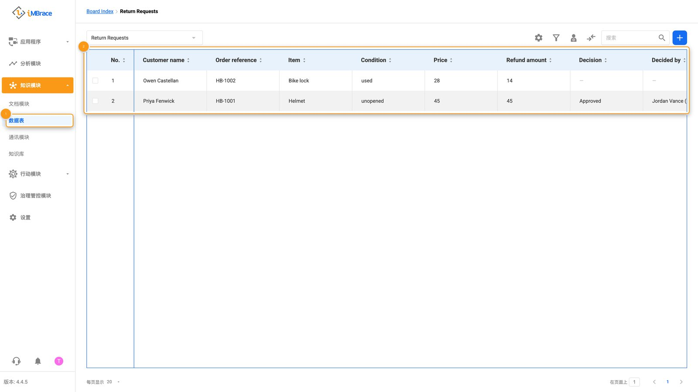
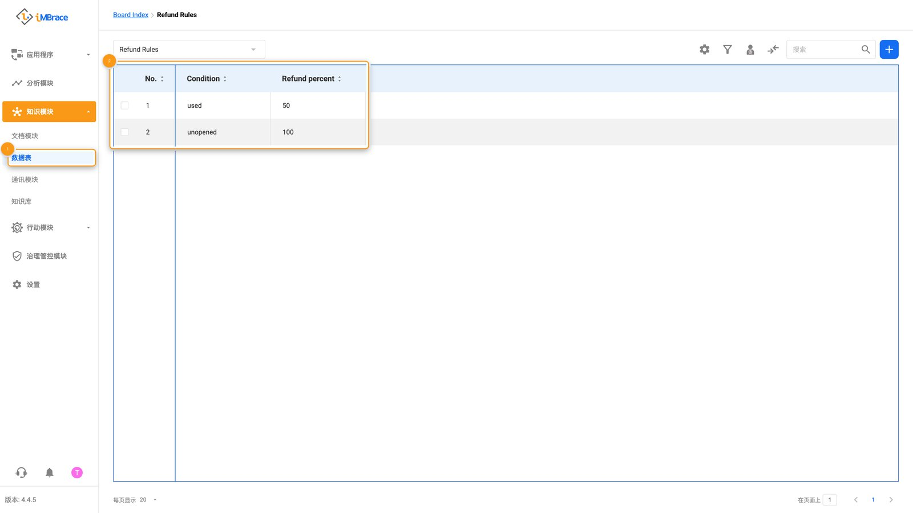
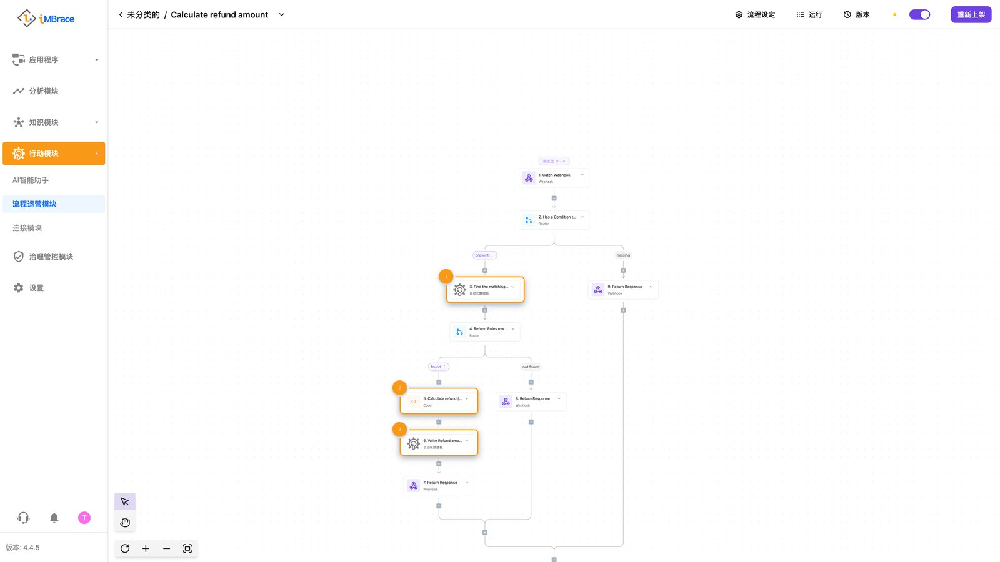
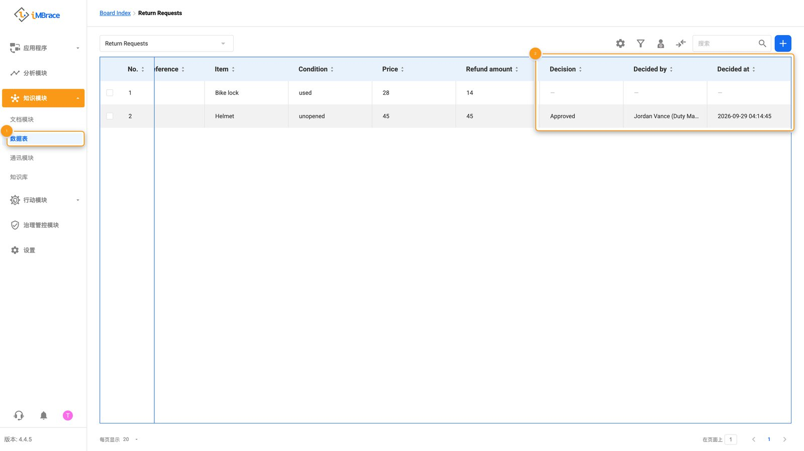
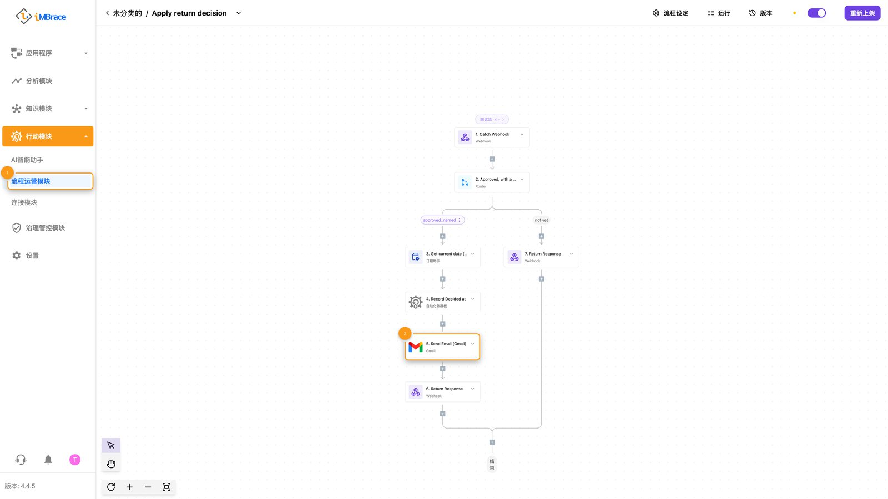
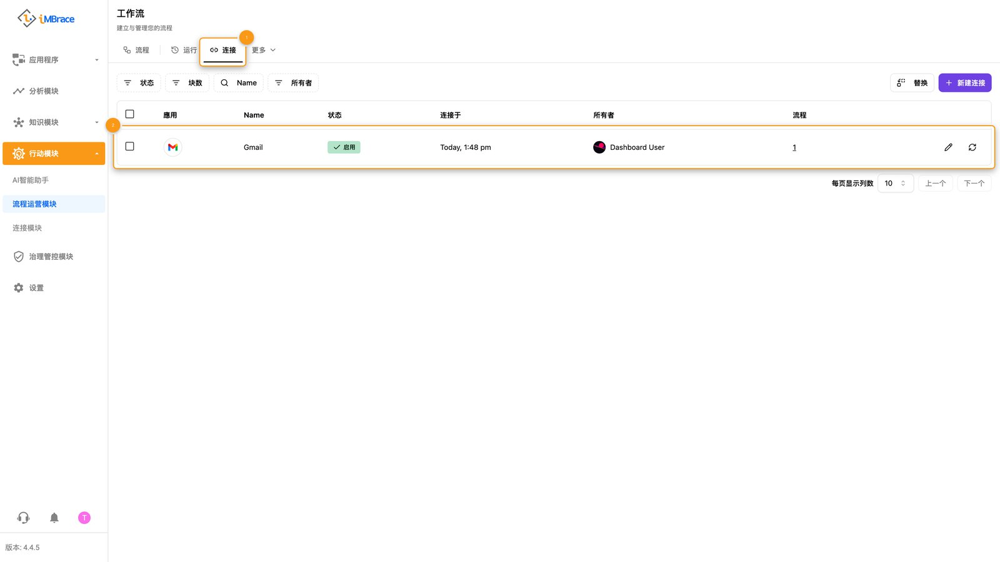
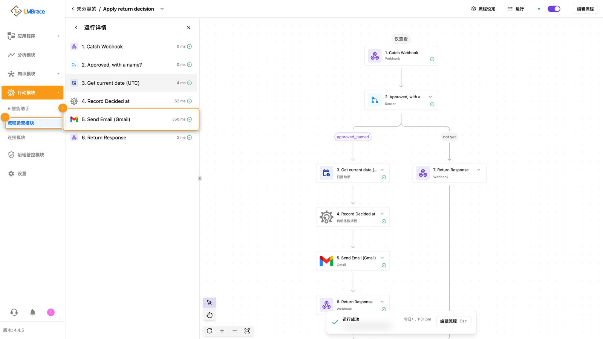
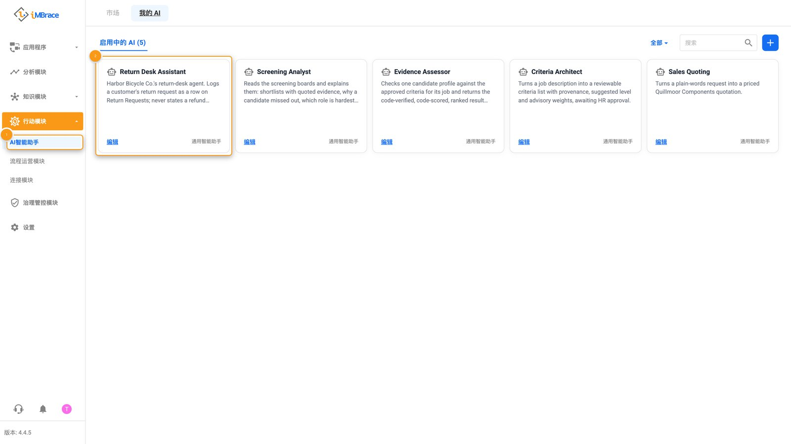
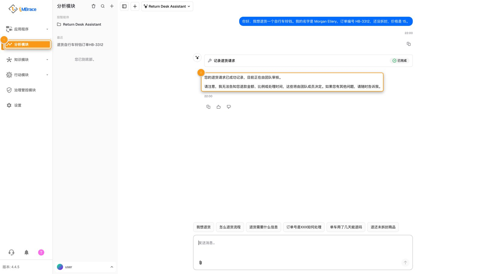

这是课程的第 2 级：动手构建。前面的级别展示一个完整运作的用例；本页则由你亲自动手构建一个。

完成后，你会在自己的测试组织中运行起一个小型智能体。它刻意做得很小。重点不在这个智能体本身，而在五个习惯——它们让你在 iMBrace 上构建的任何东西都值得信赖，第 3 级“构建得好”会对此深入讲解。

## 你将构建什么

设想一家虚构公司 Harbor Bicycle Co.，在网上销售并维修自行车。你要为它构建退货台的智能体。一位客户写信要求退货。这个智能体应当：

1. 把这次请求记录为数据表上的一行，而不是把它留在聊天记录里。
2. 根据 Harbor 任何人都能编辑的规则算出退款金额，而不是靠模型自己做运算。
3. 在向客户做出任何承诺之前，等待有人批准这一行。
4. 只有在获得批准之后，才向客户发送确认——使用平台自身的电子邮件连接，绝不把凭证放在你的工作流程里。

这里的一切都不是 Harbor Bicycle Co. 的真实系统——它并不存在。在把这个演示给任何人看之前，请换成你自己的公司、商品和规则。

## 你需要什么

- 一个测试组织和一个 API 密钥。如果你还没有，[API 密钥指南](https://engineer.imbrace.co/zh-cn/guides/api-key/)说明了如何从仪表板生成一个。这里请使用测试组织的密钥——绝不使用生产环境的密钥。
- 一个通过 MCP 连接到该组织的 AI 编程工具，这样它就能直接看到你的数据表和工作流程，而不用猜测。本页不指定具体工具；任何能保持 MCP 连接并读取文本文件的编程助手都可以。[MCP 指南](https://engineer.imbrace.co/zh-cn/mcp/overview/)有你所用工具的具体连接步骤——请先完成这一步，再开始下面的第 1 步。如果你的部署未启用 MCP，[快速开始](/learn/build-it/getting-started/)展示了 SDK 的路径。
- 如果你的工具更倾向于编写真正的 SDK 代码，而不是直接调用平台，请安装你所用语言的 SDK：

  ```bash
  npm install @imbrace/sdk
  ```

  ```bash
  pip install imbrace
  ```

  无论哪种方式，你的工具最终都需要两个环境变量：`IMBRACE_API_KEY` 和 `IMBRACE_ORGANIZATION_ID`。把它们保存在本地的 `.env` 文件中，绝不提交到任何地方；如果可以把变量名交给编程工具，就绝不要把真实密钥粘贴进与它的对话里。
- 大约一个小时。其中大部分时间用于阅读平台返回给你的内容——这正是本页想要培养的习惯。

本页会用到几个词：<strong>数据表</strong>（board）是你自己设计的结构化表格——有行，也有带类型的列，就像一张轻量版的 CRM 表。<strong>工作流程</strong>（workflow，也称为流程）是一连串步骤，一旦触发就会自行运行。<strong>原生步骤</strong>是平台自带的现成步骤——不用自己编写代码，不用自己托管，也不用自己管理密钥。<strong>智能体</strong>（AI Agent）是供用户或渠道对话的前端界面；在产品的侧边栏里，它列在“行动模块”（Actions）>“AI智能助手”（AgentIQ）下。

## 步骤

### 1. 动手之前先看一看

先别打开编辑器。让你的编程工具告诉你已经有什么。

<strong>你输入</strong>，大致是：

> 在我们开始构建任何东西之前：这个组织里已经有哪些数据表？另外，在平台原生工作流程步骤的目录里，搜索与发送邮件和读取邮件相关的内容。

<strong>你应该会看到</strong>：在一个全新的测试组织中，数据表列表是空的——这是预期结果，不是失败。如果这个组织已经有其他工作在跑，这一步看到的会是其他已有的数据表——这也没问题；等你在第 2 步创建了自己的数据表后，按名称去里面找它就好。不管是哪种情况，你都应该还会看到一份关于邮件的原生步骤简短列表，很可能还夹杂着你没问到的其他渠道。把这份列表读一遍。这是要养成的习惯：在考虑自己写一个之前，先找到平台已经提供的步骤。工具从零写出的步骤，需要你持有一个凭证、维护一段代码；原生步骤两样都不需要。

### 2. 创建保存退货申请的数据表

<strong>你输入</strong>：

> 创建一个名为 Return Requests 的数据表，包含以下列：Customer name、Order reference、
> Item、Condition、Price、Refund amount、Decision、Decided by、Decided at。

<strong>你应该会看到</strong>：组织里出现一张新的数据表，带有这九个列，还没有任何行。在平台里打开它，亲眼核对列名和类型——不要只相信工具对自己所做操作的总结。

如果你的工具说它无法创建任何东西，说明它的 MCP 连接是只读的——这是默认设置。按照 MCP 页面所说的方式添加写入权限（连接地址上的一个标志），并且务必只在测试组织上这样做。

### 3. 添加两行测试数据

使用虚构数据。即使是在测试组织中，也绝不使用真实的客户或订单信息。

<strong>你输入</strong>：

> 在 Return Requests 中添加两行。客户姓名和订单编号请编造得一看就是假的。第一行：一个未
> 拆封的头盔，价格 45。第二行：一把已使用的自行车锁，价格 28。Refund amount、Decision、
> Decided by 和 Decided at 留空。

<strong>你应该会看到</strong>：两行数据，Condition 分别为“unopened”和“used”，Price 已填好，最后四列为空。


<span class="imb-legend">1“知识模块”（Knowledge）>“数据表”（DataIQ）。2 Return Requests 数据表的字段与数据行。</span>

### 4. 把退款规则放在有人能改的地方，而不是写进一句话里

这是本页最重要的一个习惯。在智能体的指令里直接写“未拆封全额退款，已使用退一半”会更快。不要这样做。写进智能体指令里的规则，只有编辑该智能体的人才能修改，不能原样引用给客户看，事后也无法审计。而以一行数据存在的规则，这三点都能做到。

<strong>你输入</strong>：

> 创建第二张数据表，名为 Refund Rules，包含两列：Condition 和 Refund percent。添加两行：
> unopened，100；used，50。

<strong>你应该会看到</strong>：一张两行两列的数据表。Harbor Bicycle Co. 的任何人都可以打开它，把 50 改成 60，而不用碰工作流程或智能体。


<span class="imb-legend">1“知识模块”（Knowledge）>“数据表”（DataIQ）。2 Refund Rules 数据表的两条数据行。</span>

### 5. 构建工作流程，让一个小步骤来做运算

<strong>你输入</strong>：

> 在 Return Requests 数据表上构建一个名为 Calculate refund amount 的工作流程，在有行被
> 新增或修改时运行。它应当：读取该行的 Condition，在 Refund Rules 里查找匹配的行，用一个
> 普通的计算步骤把 Price 乘以 Refund percent，并把结果写入 Refund amount。数据表的读取和
> 写入都使用原生步骤。只有乘法运算本身需要你自己写一个步骤，并且保持它纯粹——输入两个数字，
> 返回一个数字，不涉及其他任何事。这个步骤内部不发起网络调用，也不持有任何凭证。

<strong>你应该会看到</strong>：一个可以在平台自带的编辑器里打开、从头到尾读下来而无需打开任何代码的工作流程。它的大多数步骤都是原生的。恰好有一个步骤是你的工具写的那段简短计算，短到十秒钟就能读完。如果你的工具提供试运行选项，就手动运行一次，检查 Refund amount 是否落在未拆封头盔的 45 和已使用车锁的 14 上。


<span class="imb-legend">1“Find the matching...”查找 Refund Rules 上符合的数据行（原生步骤）。2“Calculate refund (...)”唯一一行手写的计算步骤。3“Write Refund amo...”把结果写回数据行（原生步骤）。</span>

这是第二个习惯：模型擅长判断该适用哪条规则，但不该被信任在压力下、悄无声息地、每一次都算对乘法。让计算步骤去做运算。让模型来做判断，让代码来做计算。

### 6. 加入批准关卡

<strong>你输入</strong>：

> 在 Return Requests 上构建第二个名为 Apply return decision 的工作流程，在 Decision 列
> 发生变化时运行。除非 Decision 为 Approved 且 Decided by 填有姓名，否则它什么都不做；满
> 足条件后，它会把时间记录到 Decided at 里。没有决定的行，或者有决定但没有姓名的行，都不
> 能再往下走。

<strong>你应该会看到</strong>：目前两行都没有任何反应——两行都还没有决定。你自己打开数据表，只在未拆封头盔那一行，把 Decision 设为 Approved，并在 Decided by 里填上你的名字。然后按下<strong>保存</strong>（Save）：数据表的编辑在保存之前都是待定状态，保存之前不会触发任何事。已使用车锁那一行保持不动。只有已批准的那一行会填上 Decided at。


<span class="imb-legend">1“知识模块”（Knowledge）>“数据表”（DataIQ）。2 Decision、Decided by、Decided at 三个字段。</span>

这是第三个习惯：决定是写在一行上的一个值，带着是谁、何时决定，而不是有人在与智能体的聊天里打出“看起来没问题”。如果没有人设置 Decision，下游就不该有任何动作——完成这一步之后，确实也没有。

### 7. 用安全的方式发送确认

<strong>你输入</strong>：

> 先在 Return Requests 中新增一个 Customer email 列。然后扩展批准工作流程：在记录完决定之后，使用平台自带的已连接邮件步骤，向该列中的地址发送一条简短确认，写明退款金额。不要在这个工作流程的任何地方放入邮箱密码或 API 密钥——使用组织中已有的连接；如果还没有，就先创建一个。

<strong>你应该会看到</strong>：工作流程里，在记录 Decided at 的步骤之后，只在批准分支上多了一个 Send Email (Gmail) 步骤。批准未拆封头盔那一行并点击<strong>保存</strong>（Save）：工作流程会运行一次，确认邮件会发到该行的 Customer email，写明退款金额。仍待处理的那一行不会启动任何运行，所以不会发出任何东西。


<span class="imb-legend">1“流程运营模块”（FlowOps）。2“Send Email (Gmail)”步骤，接在记录 Decided at 的步骤之后，位于批准分支。</span>

要检查凭证，请打开“行动模块”（Actions）>“流程运营模块”（FlowOps）>“更多”>“连接”。邮件凭证在那里，是一个独立命名的连接，名为 Gmail，工作流程的任何步骤里都没有存放它。这正是从第 1 步延续下来的习惯：凭证属于平台自身的连接库，绝不属于某个工作流程。如果之后导出这个工作流程，打开导出的文件，确认里面没有任何密钥或密码。


<span class="imb-legend">1“流程运营模块”（FlowOps）>“更多”>“连接”。2 唯一一个名为 Gmail 的连接。</span>

数据表本身不会显示任何发信记录。要确认，请打开工作流程的运行历史：已批准那一行的运行已经完成，其中的 Send Email (Gmail) 步骤标示为成功。邮件本身在收件人的收件箱里。


<span class="imb-legend">1“流程运营模块”（FlowOps）。2 该次运行的“Send Email (Gmail)”步骤，标示为成功。</span>

该使用哪种邮件连接：邮件服务器（SMTP）连接只需用服务器信息设置一次。像 Gmail 这样的托管邮件服务，需要有人在每个组织中登录一次该服务商。无法访问互联网的部署环境，则在自己的网络内使用邮件服务器（SMTP）连接。

### 8. 创建智能体

智能体是通过 SDK 的智能体方法（网站上有介绍）或平台的智能体界面来创建的，所以这一步会用到其中一种方式。无论哪种方式，你的工具都可以为智能体编写指令。

<strong>你输入</strong>：

> 首先构建一个名为 Log return request 的工作流程，供智能体作为工具调用。它接收 Customer
> name、Order reference、Item、Condition 和 Price，在 Return Requests 上只用这五个值创建
> 一行，不写入其他任何内容。然后创建一个名为 Return Desk Assistant 的智能体，只给它这一个
> 工具——而不是整张数据表本身。它的职责是：当客户描述想要退的商品时，用这个工具记录下来，
> 并回复对方请求正在审核中。它绝不能说出退款金额，也绝不能做出任何承诺——因为人还没有做出
> 决定。


<span class="imb-legend">1“行动模块”（Actions）>“AI智能助手”（AgentIQ）。2 Return Desk Assistant 智能体卡片。</span>

为什么用工具而不是整张数据表：如果把整张数据表都交给智能体，它就能写入其中任何一列，包括 Decision——它可能会批准自己记录的申请。而这个工具只能写入客户提供的那五列，这样决定权就留在了人手里。

还有一个值得写进智能体自身指令的习惯：Refund Rules 是按精确值来匹配的，所以要告诉智能体，写入 Condition 时使用规则本身的这两个词——unopened 或 used——绝不能用客户自己的说法，也不能把它翻译一遍。任何一张由自然语言智能体写入、又被工作流程按精确匹配来查找该行的数据表，都需要同样的谨慎。

<strong>你应该会看到</strong>：对着新的智能体说类似“我想退订单 HB-2044，一顶头盔，还没拆封。我叫 Morgan Ellery，花了 39”这样的话，会在 Return Requests 上产生一行新数据，把这些细节填好，并得到类似“你的退货申请已登记，正由团队审核”的回复——没有数字，没有承诺。如果你的工具草拟的指令让智能体自己猜出一个退款数字，这里正好能抓出这个问题：把它退回去，要求把数字从智能体可以说的内容里去掉。然后让它试着自己批准这次申请：它必须做不到，因为它的工具里没有任何东西能写入 Decision。


<span class="imb-legend">1“分析模块”（InsightsIQ）。2 智能体的回复没有提到金额，也没有任何承诺。</span>

## 如何检查是否成功

不要把编程工具对自己所做操作的总结当作证据。一个听起来合理、构建成功的说法很容易编造出来，也很容易被误当真——自己去看一看。

- 打开 Return Requests。两行都应显示正确的 Refund amount：45 和 14。
- 只有你批准的那一行应有一次运行，且其中的 Send Email (Gmail) 步骤标示为成功；待处理的那一行完全不应有任何运行。
- 打开工作流程的运行历史，阅读每次运行的实际状态，而不是它的摘要——仍在等待的运行，和已经完成的运行看起来是不同的。
- 打开“行动模块”（Actions）>“流程运营模块”（FlowOps）>“更多”>“连接”，确认邮件凭证是一个具名连接，而不是某个步骤里的文本。
- 用一个新编的退货案例与 Return Desk Assistant 对话。确认出现了一行数据，并且智能体的回复不带任何数字，也不带任何承诺。
- 让这个助手批准一次申请。确认 Decision 仍为空：智能体没有办法写入它。
- 现在也批准已使用车锁那一行，确认它的确认邮件同样发送出去——证明这个关卡是真实的，不是摆设。

如果以上任何一条不成立，这比一个看起来没问题、实际上却有问题的构建更有价值。修好出问题的那一处，再检查一遍。

## 接下来做什么

- 尝试第二种状况——比如少了包装盒退回的零件——并添加第二条规则行。确认你能改变退款比例，而不用碰工作流程或智能体。
- 试着对某一行始终不做任何批准——确认无论放多久，客户都不会收到退款数字。
- 阅读第 3 级“构建得好”，了解这五个习惯背后更完整的方法——它讲的是如何让这样的构建经得起交到真实客户手上的考验，而不只是停留在测试组织里。
- 关于 SDK、CLI 或 MCP 连接本身的任何内容，[engineer.imbrace.co](https://engineer.imbrace.co/zh-cn) 是保持最新的信息来源——本页的内容会先过时，那个网站不会。[快速开始](/learn/build-it/getting-started/)有完整的设置说明。
