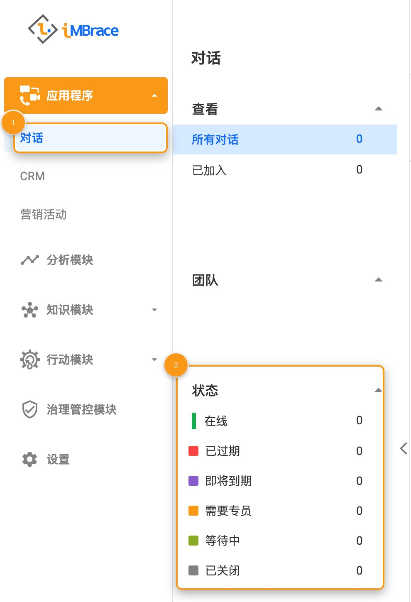
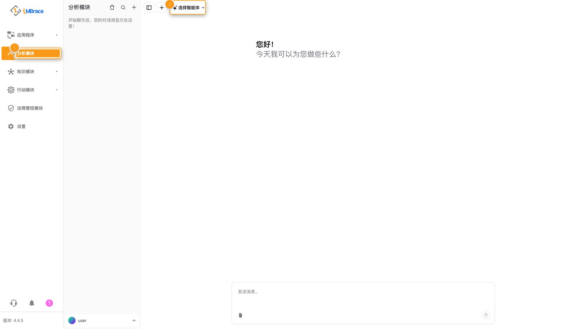
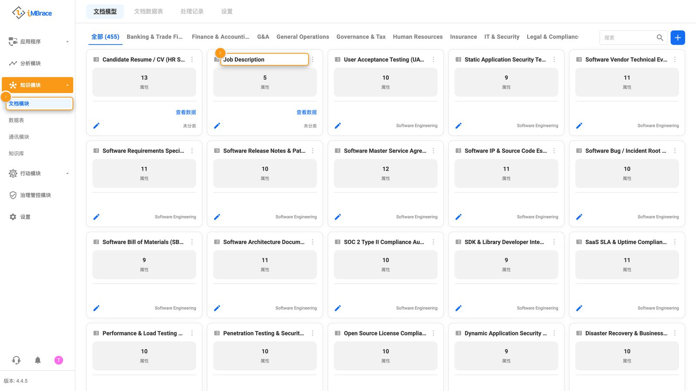
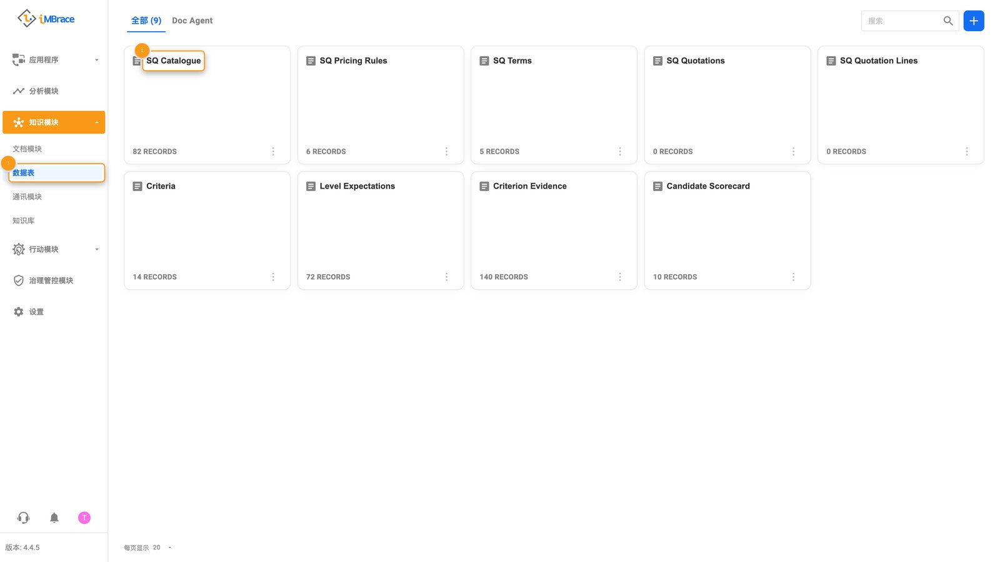
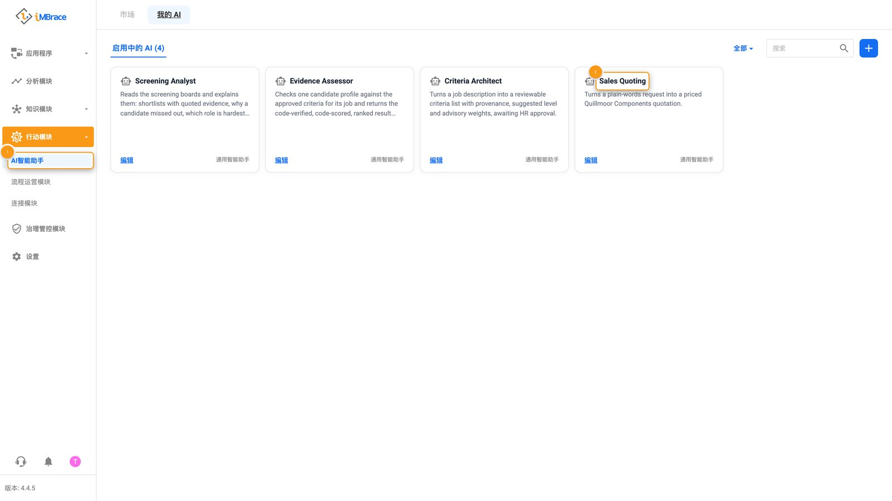
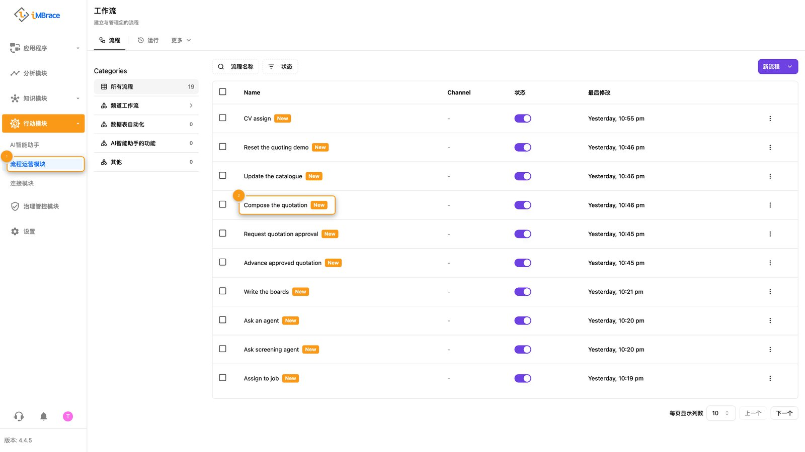
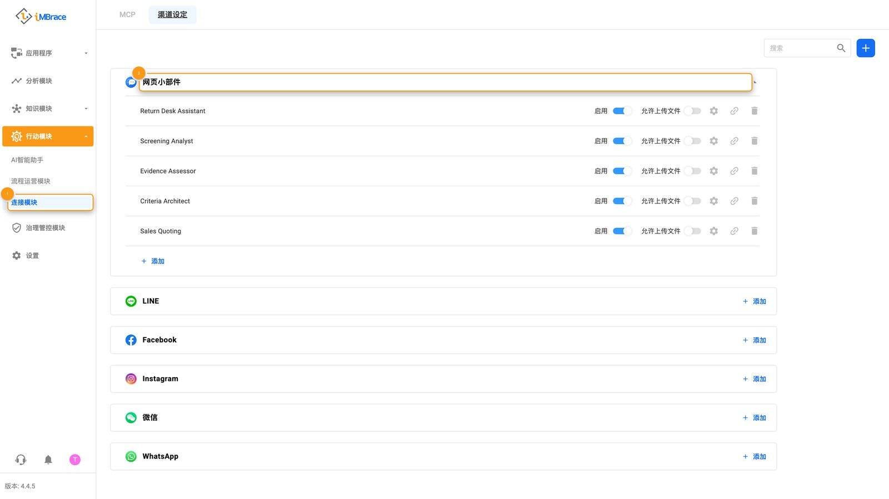
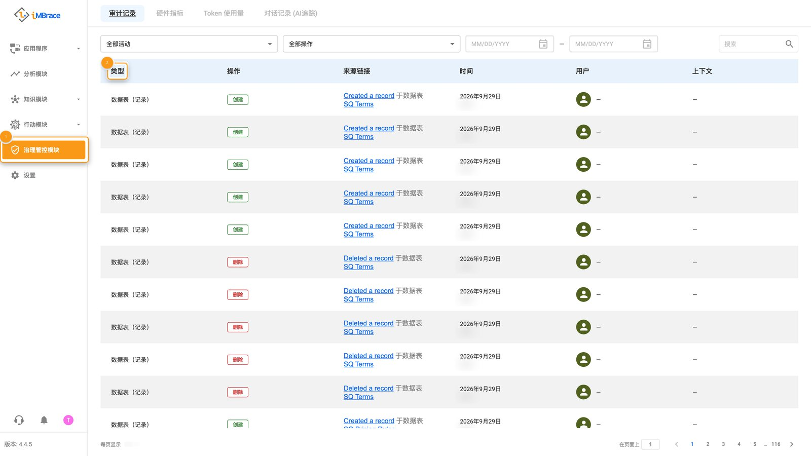
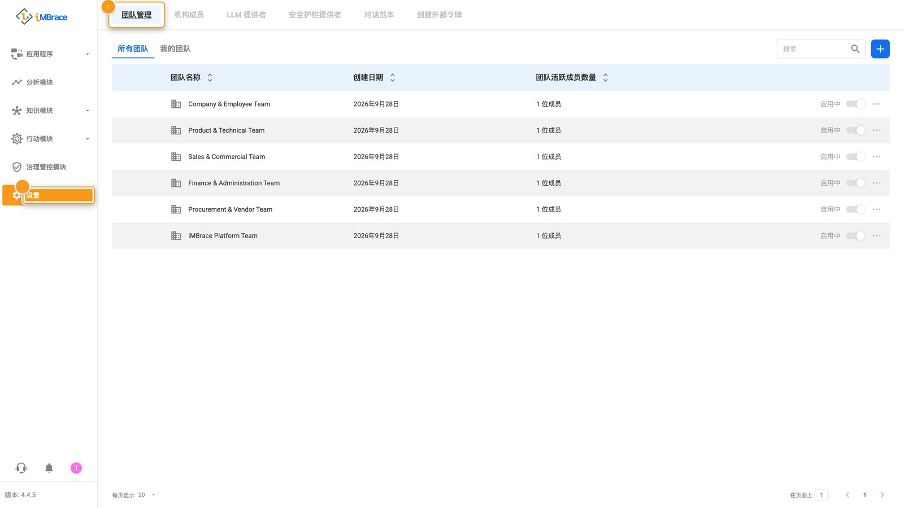

这是 iMBrace 组织的侧边栏，按它排列的顺序逐一走一遍：应用、分析模块（InsightsIQ）、知识模块、
行动模块、治理管控模块和设置。每个区域只停留一小段——它是做什么用的、打开后能看到什么，以及
在那里最值得给客户看什么。第一次做演示前先读一遍，之后把它当成清单打开，带别人走一遍平台时
随时对照。

## 应用

应用是与客户或员工的对话真正发生的地方。它打开后停在“对话”（Conversations），这是一个共享
收件箱，汇总来自所有已连接渠道的每一条消息，并带有按视图和按状态筛选的标签——在线、逾期、
需要客服、待处理、已关闭。无论消息从哪个渠道进来，都汇总成同一份列表。可以给客户展示一条对话
实时进来的样子，也可以筛选到“逾期”，展示没有任何一条被漏答。

1 “应用”（Applications）>“对话”（Conversations）。2 共享收件箱的“状态”筛选。

## 分析模块

“分析模块”（InsightsIQ）是你直接和智能体对话、看它如何处理一个问题的地方。它打开后停在一个
对话界面：用来选择你要问哪个智能体的选择器，以及用来提问的输入框。输入一个真实的问题，展示
答案是如何出现的——它背后是该组织自己批准的知识，如果答案不在其中，也会明确说明。实际效果见：
[简历筛选全流程](/learn/see-it-work/cv-screening/)和[销售报价](/learn/see-it-work/sales-quoting/)。

1 “分析模块”（InsightsIQ）。2 智能体选择器。

## 知识模块

“知识模块”（Knowledge）保存着该组织所掌握的一切：读取其文档的模型、保存其结构化记录的数据表，
以及智能体据以作答的资料。

## 文档模块

“文档模块”（DocIQ）是文档模型把一份非结构化文件——一张发票、一份表单、一份简历——变成一条
结构化记录的地方。它打开后停在“文档模型”（Document Models），这是一个已经按类别整理好的库，
类别包括财务与会计、人力资源、销售与客户，旁边还有文档表和处理日志。打开一个已经和客户自己的
单据相匹配的模型，展示它逐个字段提取出的内容。

1 “知识模块”（Knowledge）>“文档模块”（DocIQ）。2 一张文档模型卡片。

## 数据表

“数据表”（DataIQ）是结构化记录真正存放的地方：一张数据表，由你自己定义的行和有类型的列组成。
它打开后是一张张数据表卡片，每张卡片显示数据表的名称和它保存的记录数。打开一张数据表，直接从
表里读一行真实数据——工作流程的步骤、智能体的技能，以及文档模型的提取结果，读写的都是同一张表。

1 “知识模块”（Knowledge）>“数据表”（DataIQ）。2 一张数据表卡片。

“文档模块”（DocIQ）的文档模型和“数据表”（DataIQ）的数据表，是每一个 iMBrace 构建都由其搭建而成
的[五个基本部件](/learn/build-it/building-blocks/)中的两个；接下来的“行动模块”（Actions）则包含
另外三个——智能体、工作流程和渠道。

## 通讯模块

“通讯模块”（CommsIQ）与“文档模块”（DocIQ）和“数据表”（DataIQ）并列，有自己的“全部”标签页。

## 知识库

“知识库”（KB）是直接上传参考资料的地方——PDF、Word、PowerPoint、Excel、CSV、视频或图片
文件——按文件夹整理，供智能体直接引用作答，不必有人重新键入。如果客户自己的资料已经上传，
就打开对应的文件夹，展示智能体的回答如何直接引用其中的内容。

## 行动模块

“行动模块”（Actions）是另外三个基本部件所在的地方：负责对话的智能体、负责完成工作的工作流程，
以及负责来回传递信息的渠道。

## AI智能助手

“AI智能助手”（AgentIQ）是搭建和配置智能体的地方。它打开后是三个标签页——“市场”（Marketplace）、
“我的 AI”和“启用中的 AI”——“启用中的 AI”列出每一个已经在工作的智能体，每一个都有自己的卡片：销售报价
智能体的卡片上写着“把一句大白话的请求，变成一份带价格的 Quillmoor Components 报价单”。打开某个
智能体的“行为设置”，滚动到“功能”（Skills），可以清楚看到它配置了调用哪些工作流程，每一个都是
为特定任务搭建和命名的。

1 “行动模块”（Actions）>“AI智能助手”（AgentIQ）。2 Sales Quoting 助手的卡片。

## 流程运营模块

“流程运营模块”（FlowOps）是搭建和查看工作流程的地方：一旦被触发，一串步骤就会自动运行——读取
数据表、进行计算、等待某个决定、发送消息。它打开后直接显示已经在运行的工作流程列表。打开其中
一个，指出它等待合适的人做决定的那一步，然后展示它一旦获得决定，就会自动继续并完成剩下的工作。
关于这个决定具体在哪里做出，详见[人工批准](/learn/build-it-well/human-approval/)。

1 “行动模块”（Actions）>“流程运营模块”（FlowOps）。2 工作流程列表中的一行。

## 连接模块

“连接模块”（ConnectIQ）从两个方向把平台向外连接。它的“渠道设定”（Channels）标签页列出一个人
实际联系到智能体的各种方式——一个 Web Widget（状态为已启用，并允许上传文件），以及可以添加
LINE、Facebook、Instagram、微信和 WhatsApp 的选项。它的“MCP”标签页则是 AI 编程工具用来连接、直接
查看并在某个组织上构建所需的地址和密钥——完整指南见
[engineer.imbrace.co/mcp/overview](https://engineer.imbrace.co/zh-cn/mcp/overview/)。先展示
“渠道设定”，也就是客户自己的客户已经在用的这些应用，MCP 则留给懂技术的听众看。

1 “行动模块”（Actions）>“连接模块”（ConnectIQ）。2 “网页小部件”消息渠道。

## 治理管控模块

“治理管控模块”（Governance）是平台自己保存的一份操作与事件记录，不需要任何人特地去要。它的落地标签页
“审计记录”（Audit Log）会为整个组织的活动加上时间戳并标明是谁做的——登录、文件上传、渠道变更、
数据表的改动——这样事后都可以核查；旁边还有“硬件指标”“Token 用量”和“对话记录（AI 追踪）”。打开
“审计记录”，展示真实的一行：改了什么、谁改的、什么时候改的。

1 “治理管控模块”（Governance）。2 审计记录的“类型”列。

## 设置

做演示时，“设置”（Settings）指的就是“团队管理”（Teams）和“组织成员”（Org Members）。
“团队管理”——“所有团队”和“我的团队”——是组织访问权限、设定成员在其中角色的地方，团队管理员和
代表并列，各自只能看到自己所属的团队；“组织成员”列出构成该组织的所有人。打开“团队管理”，展示
一个人的访问权限如何对应到他实际做的工作。

1 “设置”（Settings）。2 “团队管理”（Teams）标签页。

以上就是这条贯穿侧边栏的引导路径——和客户一起打开一次，每个区域都已经准备好可以展示的内容。
