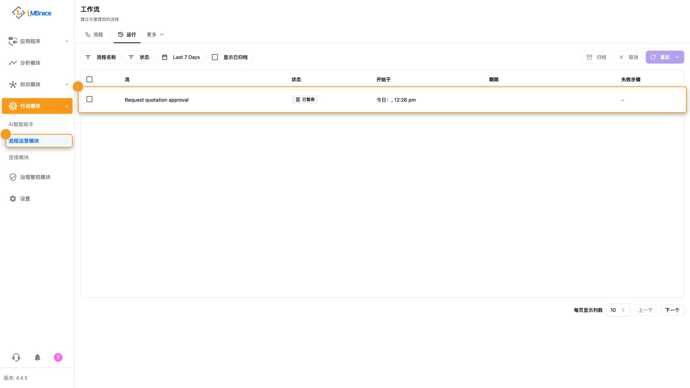
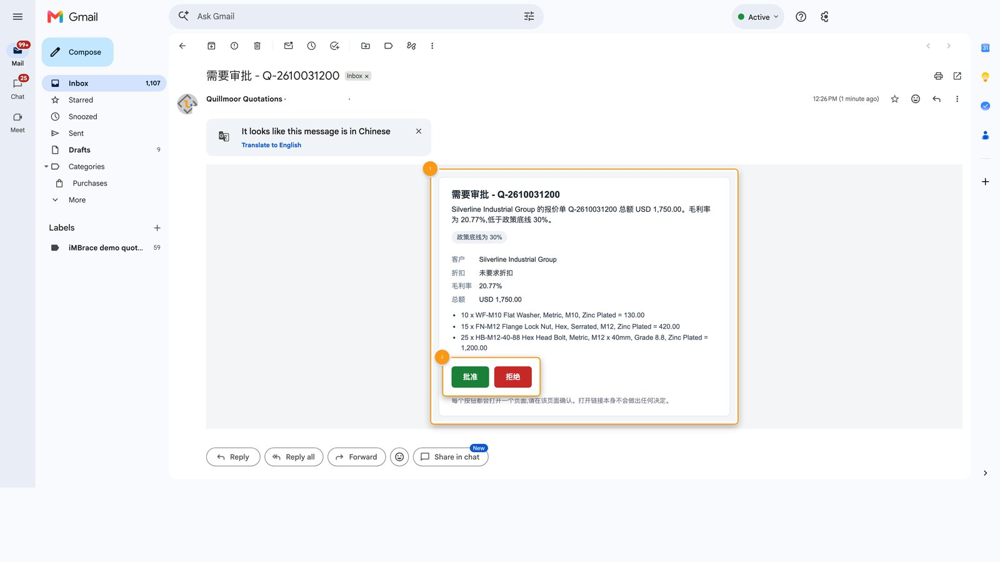
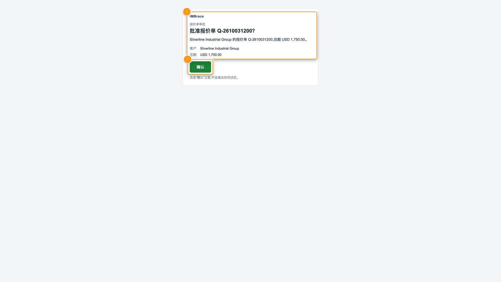
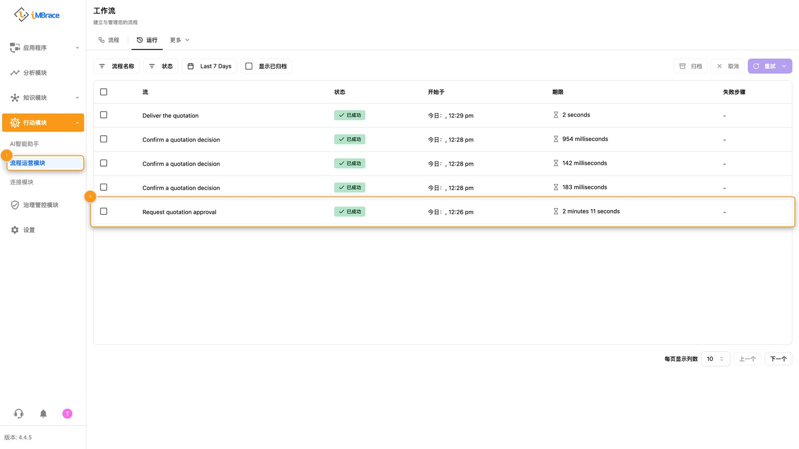
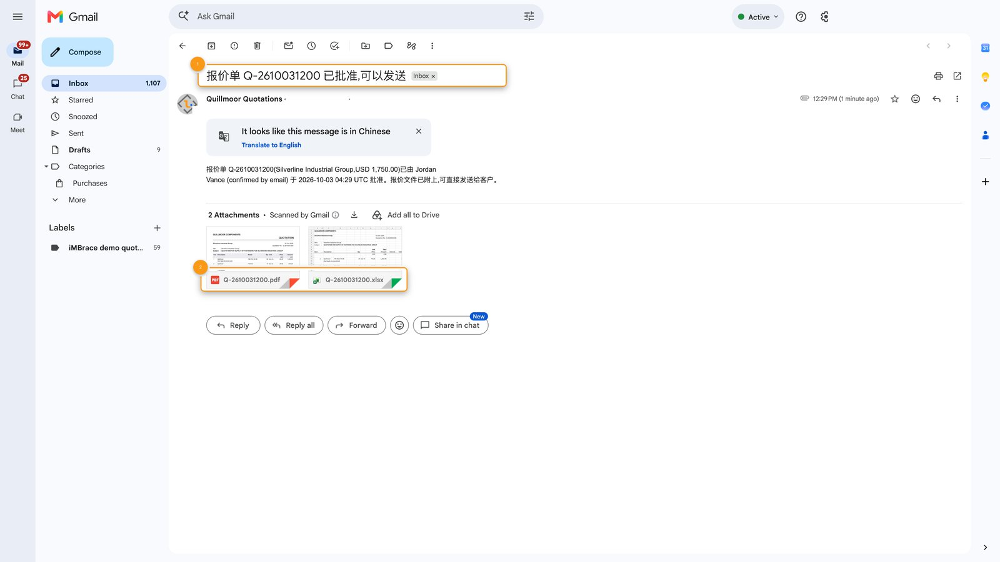

Quillmoor Components 的销售团队要从一份庞大的产品目录中，为工业紧固件和配件报价，任何让毛利率低于 Quillmoor 底线的折扣，在报价发出之前都需要经理点头同意。iMBrace 把一句大白话的请求转化为一份标好价格的报价单。毛利率低于底线时，工作会停下来等经理；经理从一封邮件里答复，同一个工作就会接着往下走，把完成的文档发给提出请求的人。

## 具体流程，一步步来看

完整的过程是这样的：

1. 销售人员用大白话向名为 Sales Quoting 的智能体提出报价请求：客户是谁、要哪些产品、数量各是多少。他们也可以附上自己的邮箱地址，完成的文档就会发到那里；没有附上时，文档会发给销售窗口。
2. 这个智能体读取 SQ Catalogue 和 SQ Pricing Rules 这两张表——即“数据表”（DataIQ）里的结构化表——分别存放着 Quillmoor 的产品和定价规则。

1　“知识模块”（Knowledge）>“数据表”（DataIQ）。2　“SQ Catalogue”数据表，Quillmoor 的产品与 SKU。

1　“知识模块”（Knowledge）>“数据表”（DataIQ）。2　折扣规则行，在“approval_threshold”字段。

3. 它算出报价内容，并逐行写入 SQ Quotations 和 SQ Quotation Lines 这两张数据表。

1　侧边栏的“分析模块”（InsightsIQ）。2　Sales Quoting 智能体的回复：逐行定价的新报价单。

4. 接着由 iMBrace 自己，根据已写入的各行明细检查毛利率——而不是听智能体怎么说。毛利率达到底线的报价单不需要批准：它的文档会自动生成，并通过邮件发给提出请求的人。
5. 毛利率低于底线的报价单则会等待。它的状态显示为等待批准，背后的工作流程（iMBrace 中一旦触发就会自行运行各个步骤的引擎）会在决策点暂停。在“流程运营模块”（FlowOps）里，这份报价单的运行会标示为 Paused（已暂停）：它没有失败，也还没有完成，而是停在原处，等一个人答复。

1　“知识模块”（Knowledge）>“数据表”（DataIQ）。2　报价单自身的状态：awaiting approval（待批准）。

1　“行动模块”（Actions）>“流程运营模块”（FlowOps）。2　这份报价单的运行，标示为 Paused（已暂停）：它正在等经理处理。

6. 经理会收到一封邮件。那是一张卡片，载明做决定所需的一切——客户、明细、折扣、毛利率、总额和政策底线——并带有两个按钮：“批准”和“拒绝”。

1　卡片：客户、折扣、毛利率、总额和政策底线。2　“批准”和“拒绝”按钮。

7. 每个按钮都会打开一个页面，显示所选的结果。仅仅打开页面，不会决定任何事；只有点击页面上的“确认”，才会记录这个决定。一旦有一个答案被确认，另一个按钮就会失效，所以一份报价单只会有一个答案。

1　所选的结果，以及它适用的报价单。2　“确认”按钮：点击之前，不会决定任何事。

点击“确认”之后的页面：报价单已批准，文档正在发送给提出请求的人。

8. 同一次运行会从停下来的地方接着往下走。平台会记录是谁批准、何时批准——也就是 Approved By 和 Approved At，这两列智能体无法写入——接着生成 PDF 和 Excel 文件，并通过邮件发给提出请求的人；如果一开始没有附上地址，则发给销售窗口。

1　“行动模块”（Actions）>“流程运营模块”（FlowOps）。2　同一次运行，现在标示为 Succeeded（成功）：它从等待的地方接着往下走，并且完成。

1　“知识模块”（Knowledge）>“数据表”（DataIQ）。2　这份报价单的行：状态为 approved（已批准），Approved By 与 Approved At 已填写。

1　告知提出请求的人，报价单已批准、可以发送的邮件。2　两个附件：PDF 和 Excel 文件。

如果经理改点“拒绝”，这个拒绝会被记录下来，不会生成任何文档，并且会通知提出请求的人。

## 由人来决定的地方

毛利率低于底线的报价单，必须等经理决定之后，才能发出任何东西。它会停在这一步，是因为规则本身不允许的折扣，理应始终由人来决定——并且每一次都由 iMBrace 自己按同样的方式核实，而不是依赖人的记忆。

经理在自己本来工作的地方做决定：收件箱，事实和两个按钮就在眼前。在他们答复之前，不会有任何东西发出去。如果一直没有人答复，报价单会保持暂停、清晰可见——在它自己的数据表上，也在“流程运营模块”里——也不会发出任何文档。等他们答复时，同一次运行会继续下去——不是重新开始——并把事情做完。

这就是这个用例要展示的：iMBrace 在人做决定的期间，替这次运行保留它的进度，等对方答复再接着往下走。这次运行接触的，是人、消息和文档——一位经理、一封邮件，以及一份完成的报价单。

## 不写代码也能调整的内容

报价单所依据的规则，以及 Quillmoor 出售的每一件商品，都是数据表上的行。

| 行 | 控制的内容 |
|---|---|
| SQ Pricing Rules 数据表上的每一条规则 | Quillmoor 期望的毛利率，以及低于多少就必须由经理批准的毛利率底线。 |
| SQ Catalogue 数据表上的每一件产品 | Quillmoor 出售的商品，以及对应的价格。 |
| SQ Terms 数据表上的每一行 | 出现在每份报价单上的措辞，例如有效期、交付和付款条款。 |

修改一行，下一份写出的报价单就会读取到这次更新——不需要重新搭建。

## 试一试

如果你是合作伙伴，你的练习组织会自带已经安装好的 Sales Quoting 功能，使用 Quillmoor Components 的产品目录和定价规则，你的合作伙伴资料包中的演示脚本，会带你实际跑一遍整个流程，从第一次请求，经过经理通过邮件批准，到提出请求的人收件箱里那份完成的报价单。其他人都可以请自己的 iMBrace 联系人，在一个属于自己的组织上看这个流程演示。
