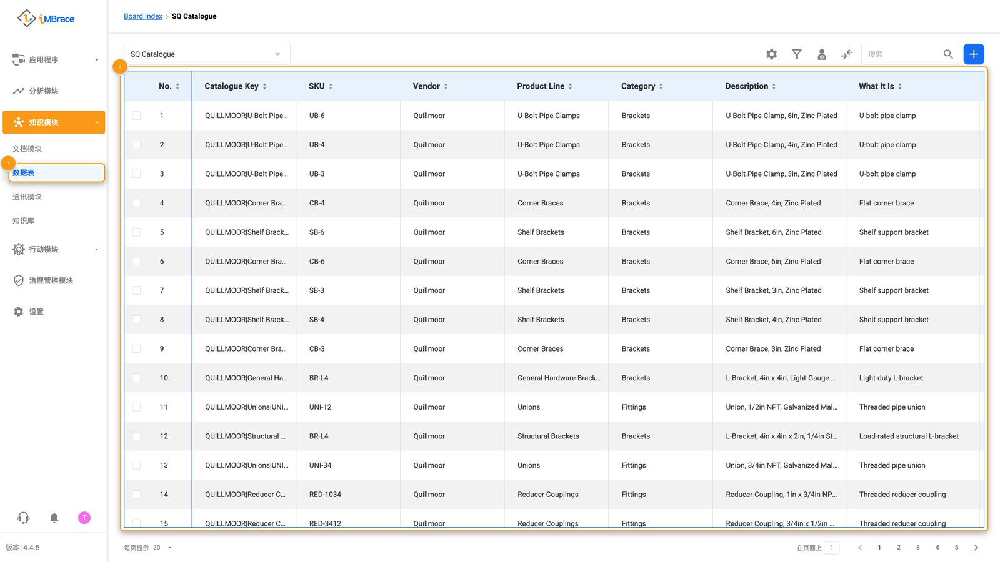
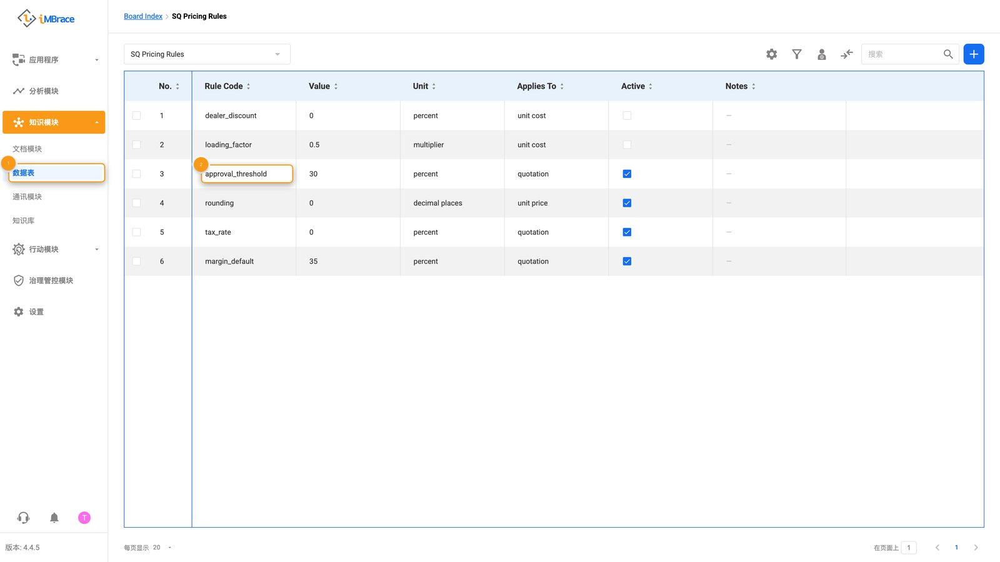
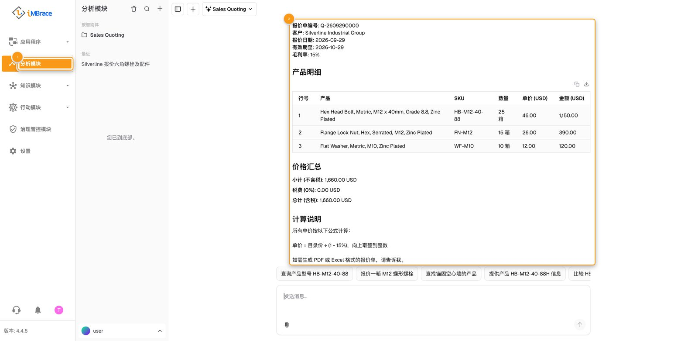
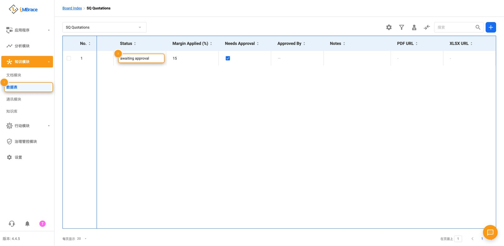
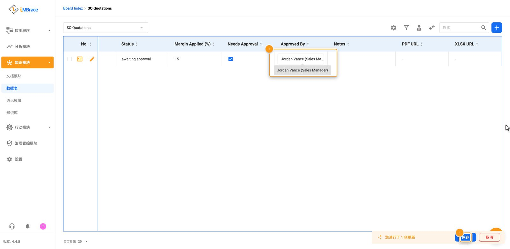
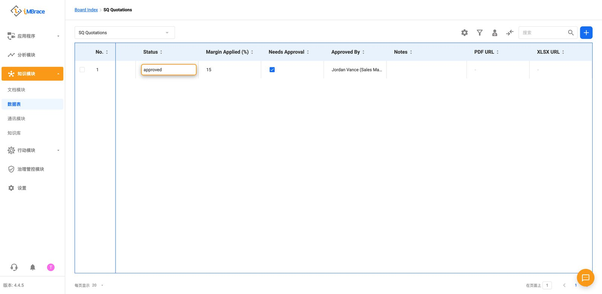
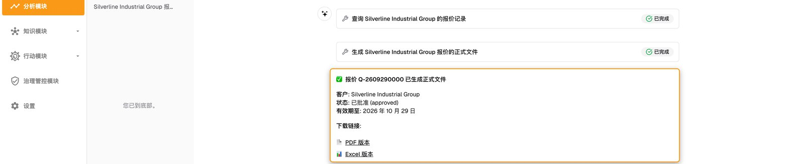

Quillmoor Components 的销售团队要从一份庞大的产品目录中，为工业紧固件和配件报价，而超出
标准规则的折扣，在报价发出之前需要经理点头同意。iMBrace 把一句大白话的请求直接转化为一份
标好价格的报价单，并且只有在超出规则的部分获得恰当人员批准之后，才允许报价单变为最终版本。

## 具体流程，一步步来看

完整的过程是这样的：

1. 销售人员用大白话向名为 Sales Quoting 的智能体提出报价请求：客户是谁、要哪些产品、数量
   各是多少。
2. 这个智能体读取 SQ Catalogue 和 SQ Pricing Rules 这两张表——即“数据表”（DataIQ）
   里的结构化表——分别存放着 Quillmoor 的产品和定价规则。

1　“知识模块”（Knowledge）>“数据表”（DataIQ）。2　“SQ Catalogue”数据表，Quillmoor 的产品与价格。

1　“知识模块”（Knowledge）>“数据表”（DataIQ）。2　折扣规则行，在“approval_threshold”字段。

3. 它算出报价内容，并逐行写入 SQ Quotations 和 SQ Quotation Lines 这两张数据表。

1　侧边栏的“分析模块”（InsightsIQ）。2　Sales Quoting 智能体的回复：逐行定价的新报价单。

4. 当请求的折扣超出 SQ Pricing Rules 数据表上的规则时，报价单的状态会显示它正在等待经理
   处理——这是平台自己卡住的，而不是靠智能体自觉。

1　“知识模块”（Knowledge）>“数据表”（DataIQ）。2　报价单自身的状态：awaiting approval（待批准）。

5. 经理直接在数据表上查看并批准它。

1　“Approved By”字段，正在输入经理姓名。2　“保存”（Save）按钮。

6. 一个工作流程——iMBrace 用来在触发后自动运行各个步骤的引擎——会自行读取到这次批准，
   并把报价单标记为最终版本。随后，销售人员向智能体索要这份已完成的报价单文档，随时可以
   发送。

报价单的状态已自动转为 approved（已批准）。

Sales Quoting 智能体的回复：完成的报价单编号，附 PDF 与 XLSX 下载链接。

## 由人来决定的地方

一份要求折扣超出标准规则的报价单，需要经理批准之后才能变为最终版本。它会停在这一步，是
因为规则本身不允许的折扣，理应始终由人来决定——并且每一次都由 iMBrace 自己按同样的方式
核实，而不是依赖人的记忆。

## 不写代码也能调整的内容

折扣所依据的规则，以及 Quillmoor 出售的每一件商品，都是数据表上的行。

| 行 | 控制的内容 |
|---|---|
| SQ Pricing Rules 数据表上的每一条规则 | Quillmoor 期望的利润率，以及需要经理批准的折扣水平。 |
| SQ Catalogue 数据表上的每一件产品 | Quillmoor 出售的商品，以及对应的价格。 |
| SQ Terms 数据表上的每一行 | 出现在每份报价单上的措辞，例如有效期、交付和付款条款。 |

修改一行，下一份写出的报价单就会读取到这次更新——不需要重新搭建。

## 试一试

如果你是合作伙伴，你的练习组织会自带已经安装好的 Sales Quoting 功能，使用 Quillmoor
Components 的产品目录和定价规则，你的合作伙伴资料包中的演示脚本，会带你实际跑一遍整个
流程，从第一次请求，到经理批准，再到最终完成的报价单。其他人都可以请自己的 iMBrace 联系
人，在一个属于自己的组织上看这个流程演示。
