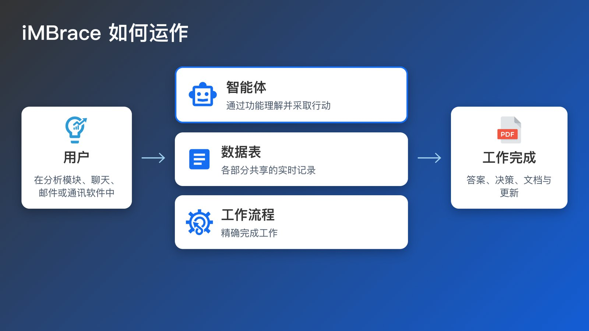

iMBrace 是一个企业级 AI 平台。它为企业提供能够根据企业自身审核过的知识回答问题的 AI 智能体、能够读取文档并将其转化为结构化记录的软件，以及能够执行日常业务流程的工作流程。企业可以完全在自己的服务器上运行它，也可以在私有云中运行，或以 SaaS 方式运行。数据存放在哪里、由哪个 AI 模型读取数据，都由企业自己决定。

## 既智能，又精准

iMBrace 让善于理解的 AI 与精确的步骤协同工作，使整个业务流程能够端到端可靠地运行。

- 智能体理解用户的提问，并依据企业自身审核过的知识作答。知识中没有的内容，智能体会如实说明。
- 工作流程精确地完成工作：路由、核对、计算，以及更新其他业务系统，每一次都以同样的方式进行。
- 重要的决定由人来做：工作流程会等待合适的人批准，然后自动继续执行。

两者结合，运行的是真实的业务流程，而不只是对话。

## 为什么需要管控

在企业系统内工作的 AI 智能体需要明确的管控。iMBrace 把这些管控内置在平台之中。

- 访问权限分层管理：按团队划分，让员工只能看到自己所属团队的知识和数据；按角色划分，让每个人的权限与其应管理还是仅使用相匹配；在企业版部署中，还可细分到记录中的单个字段，让同一张表对不同的读者显示不同的详细程度。
- 平台会记录整个系统中的活动——登录、文件上传、渠道变更，以及数据表的变更——每一项都有时间戳，如果是某人操作的，还会记录到本人名下。在企业版部署中，这项记录还会延伸到 AI 智能体的活动。
- 工作流程可以在重要的决策点暂停，等待指定的批准人处理——需要的话可以等上数小时甚至数天——然后自动继续，完成未尽的工作。谁做了决定、决定了什么、何时决定，都会随之被记录下来。
- 这些规则由平台自身的检查机制强制执行，而不是靠写进提示词里的任何内容。
- 平台运行在哪里、使用哪个 AI 模型，都由企业自己决定，包括一个从不离开企业自有场所的模型。

## 各部分如何协同运作

客户和员工通过自己已经在用的渠道接入平台：聊天挂件、WhatsApp，或其他已连接的渠道。智能体依托企业审核过的知识作答。需要动手处理的事，由工作流程完成，并按需调用企业的其他业务系统。平台从文档中提取的任何内容，或生成的任何记录，都会落到一张结构化的表上——正是这条记录，让事后核实答案或操作成为可能。一套统一的管控规则贯穿整个闭环。

iMBrace 如何运作：消息渠道连接智能体，并以审核过的知识为后盾；工作流程执行工作；结果落于数据表——全都在同一层治理管控之下。

以上是这个平台的整体概览。[iMBrace 今天能做什么](/learn/understand/capability-truth-table/) 会逐个领域给出详细说明，并附上页面或界面，方便你亲自查看每一项能力。
