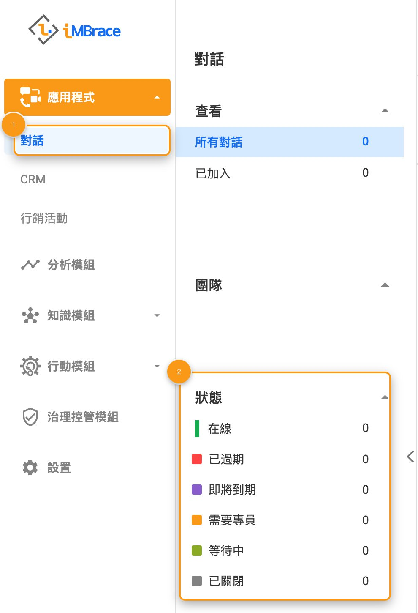
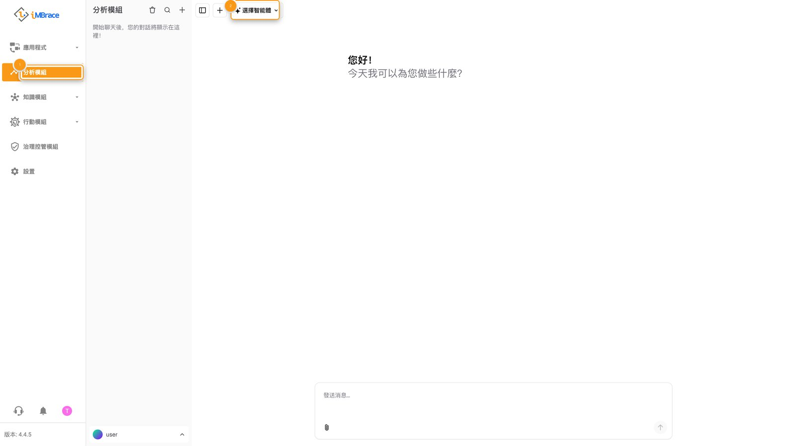
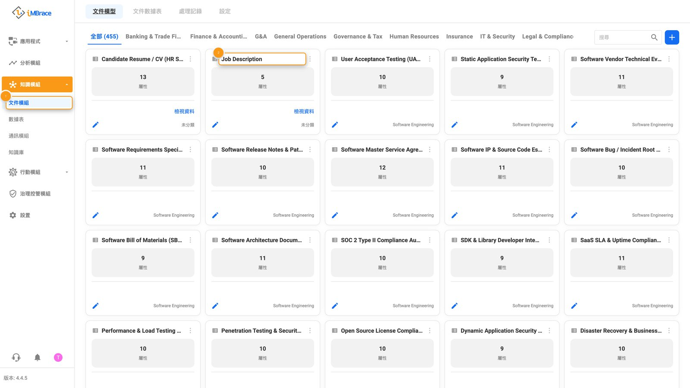
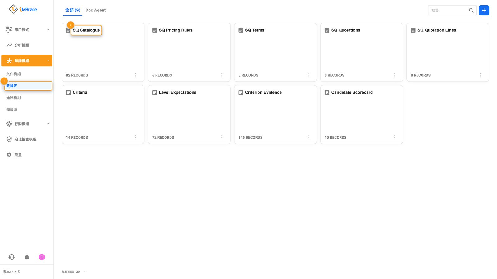
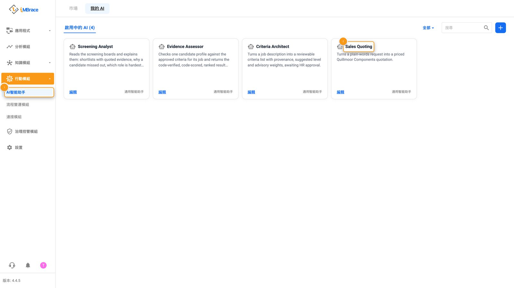
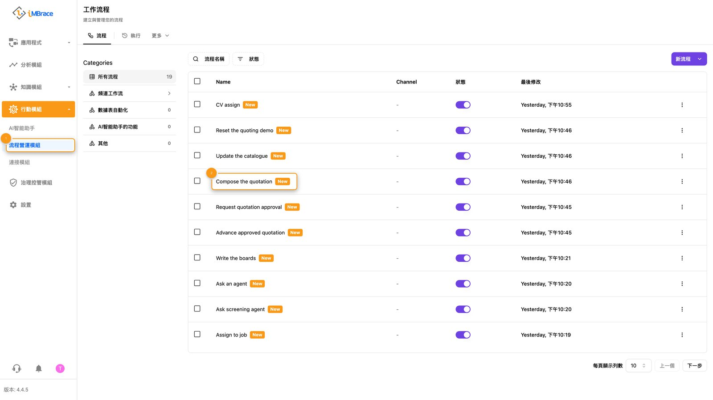
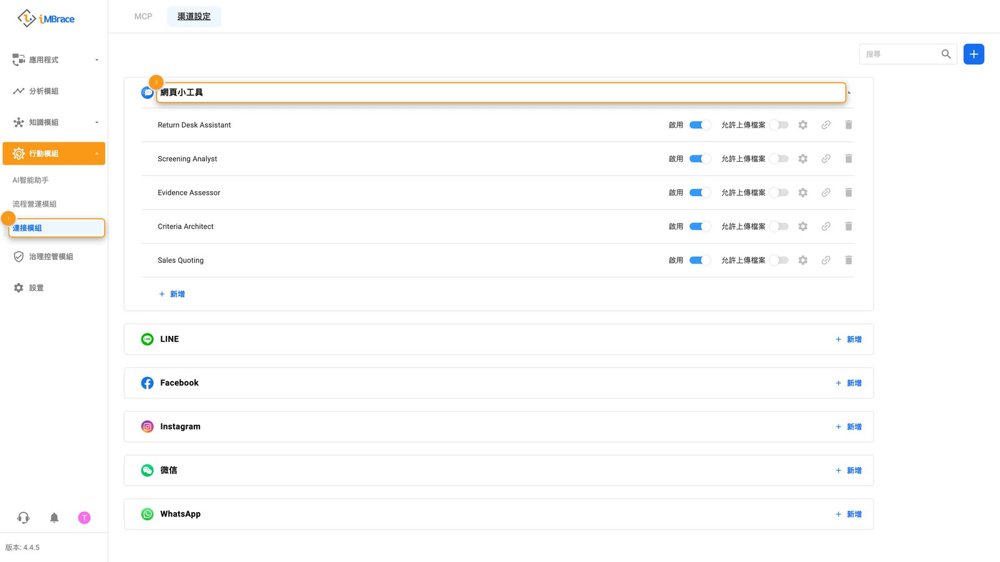
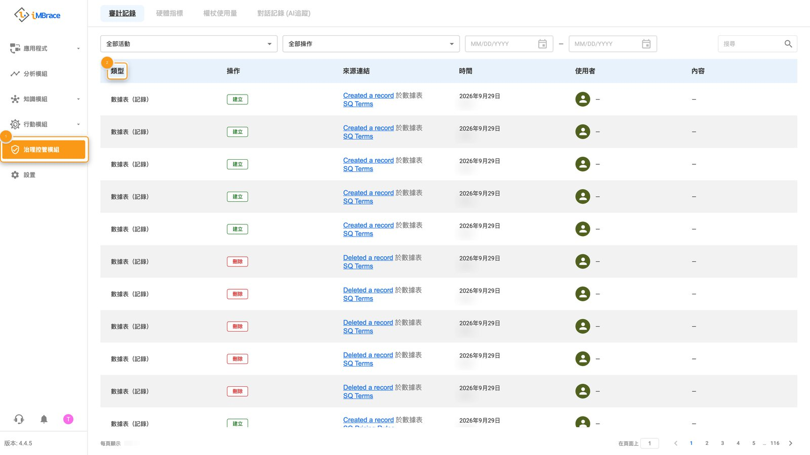
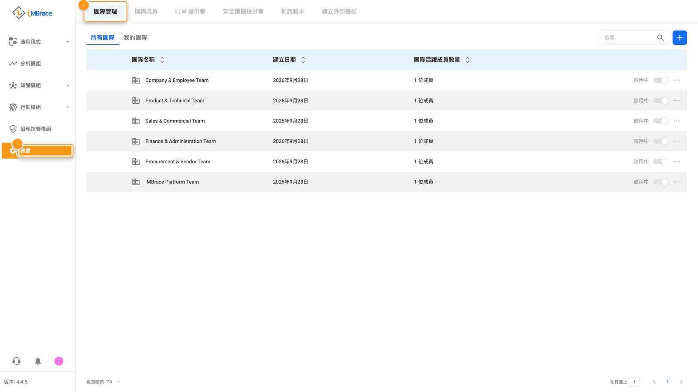

這是一個 iMBrace 組織的側邊欄，依照畫面排列的順序逐一走過：應用程式、「分析模組」（InsightsIQ）、「知識模組」（Knowledge）、「行動模組」（Actions）、「治理控管模組」（Governance）與「設置」（Settings）。每個區域只做一次簡短停留——它是做什麼用的、打開後會看到什麼，以及那裡有什麼值得展示給客戶看。在第一次示範之前先讀過一遍，之後在帶別人走一遍平台時，把它當作檢查清單開著備用。

## 應用程式

應用程式是與客戶或同仁的對話真正發生的地方。它會先打開「對話」（Conversations），這是一個共用收件匣，匯集每一則從已連接頻道進來的訊息，並附有依檢視方式與狀態篩選的標籤——線上、逾期、需要客服、待處理、已結案。不論訊息是從哪個頻道進來的，都會出現在同一份清單裡。可以向客戶展示一則對話即時進來的畫面，或篩選出逾期項目，證明沒有任何一則訊息被晾在一旁沒人回覆。

1 「應用程式」（Applications）>「對話」（Conversations）。2 共用收件匣的「狀態」篩選。

## 分析模組

分析模組是直接與代理人對話、觀察它如何處理一個問題的地方。它會先打開對話首頁：一個用來選擇要詢問哪一位代理人的選擇器，以及一個用來輸入問題的輸入框。輸入一個真實的問題，展示答案送達的過程——答案背後是組織自己核准的知識，如果答案不在其中，它也會直接說明。實際運作請見：[履歷篩選，從頭到尾](/learn/see-it-work/cv-screening/)與[銷售報價](/learn/see-it-work/sales-quoting/)。

1 「分析模組」（InsightsIQ）。2 代理人選擇器。

## 知識模組

知識模組保存組織所知道的一切：用來讀取文件的模型、用來存放結構化紀錄的數據表，以及代理人用來回答問題所依據的資料。

## 文件模組（DocIQ）

文件模組是文件模型把一份非結構化檔案——發票、表單、履歷——轉換成結構化紀錄的地方。它會先打開「文件模型」（Document Models），這是一個已依類別整理好的模型庫，例如財務與會計、人力資源、業務與客戶，旁邊還有文件數據表與處理記錄。打開一個已經符合客戶自己文件格式的模型，展示它如何逐一欄位擷取出資料。

1 「知識模組」（Knowledge）>「文件模組」（DocIQ）。2 一張文件模型卡片。

## 數據表（DataIQ）

數據表是結構化紀錄真正存放的地方：一份由你自己設計列與具型別欄位的數據表。它會先打開數據表卡片，每張卡片顯示一個數據表的名稱，以及它存有多少筆紀錄。打開一個數據表，直接從表格上讀一筆真實的資料列——這一筆資料，正是工作流的步驟、代理人的技能，或文件模型的擷取結果，共同讀取與寫入的對象。

1 「知識模組」（Knowledge）>「數據表」（DataIQ）。2 一張數據表卡片。

文件模組的文件模型，與 DataIQ 中的數據表，是每一個 iMBrace 建置成果都有的[五大基本組成元件](/learn/build-it/building-blocks/)中的兩個；接下來的行動模組，則保存另外三個——代理人、工作流與頻道。

## 通訊模組（CommsIQ）

通訊模組與文件模組、數據表並列，擁有自己的「全部」（All）分頁。

## 知識庫（KB）

知識庫是參考資料直接上傳進來的地方——PDF、Word、PowerPoint、Excel、CSV、影片或圖片檔案——並整理成資料夾，讓代理人可以直接依據它回答，不必有人重新輸入一次內容。如果客戶自己的資料已經上傳，打開對應的資料夾，展示代理人的回答直接引用自其中的內容。

## 行動模組

行動模組是另外三個元件所在的地方：負責對話的代理人、負責執行工作的工作流，以及負責來回傳遞訊息的頻道。

## AI智能助手（AgentIQ）

AI智能助手是建立與設定代理人的地方。它會先打開三個分頁——「市場」（Marketplace）、「我的 AI」（My AI）與「啟用中的 AI」（Active AI）——其中「啟用中的 AI」列出每一個已經在運作的代理人，各自有自己的卡片：Sales Quoting 代理人的卡片上寫著「把一句話寫成的請求，轉換成一份 Quillmoor Components 的報價單。」打開一個代理人的「行為設定」（Behavior Settings），捲到「功能」（Skills），就能準確看到它設定成會呼叫哪些工作流，每一個都是為特定工作打造並命名的。

1 「行動模組」（Actions）>「AI智能助手」（AgentIQ）。2 Sales Quoting 助手的卡片。

## 流程營運模組（FlowOps）

流程營運模組是建立並監看工作流的地方：一連串步驟，一經觸發就會自動依序執行——讀取數據表、進行運算、等待決策、發送訊息。它會直接打開目前正在執行的工作流清單。打開其中一個，指出它等待對的人做出決策的那個步驟，再展示一旦對方做出決策，它就會自動接著往下走、完成剩下的工作。關於這個決策實際在哪裡做出，請見：[人工核准](/learn/build-it-well/human-approval/)。

1 「行動模組」（Actions）>「流程營運模組」（FlowOps）。2 工作流清單中的一列。

## 連接模組（ConnectIQ）

連接模組以兩種方式把平台向外連接。它的「渠道設定」（Channels）分頁列出一個人實際聯繫到代理人的管道——一個網頁小工具（Web Widget）（使用中、允許上傳檔案），還有可以新增 LINE、Facebook、Instagram、WeChat 與 WhatsApp 的項目。它的 MCP 分頁，則是 AI 程式設計工具用來直接連接、查看並在一個組織上建置所需要的位址與金鑰——完整指南在 [engineer.imbrace.co/mcp/overview](https://engineer.imbrace.co/zh-tw/mcp/overview/)。先展示頻道設定，也就是客戶自己的客戶已經在用的應用程式，再把 MCP 留給技術背景的聽眾。

1 「行動模組」（Actions）>「連接模組」（ConnectIQ）。2 「網頁小工具」通訊頻道。

## 治理控管模組

治理控管模組是平台自己保存的紀錄，記下發生過什麼事，不需要任何人特地要求。它的首頁分頁「審計記錄」（Audit Log），為整個組織內的活動加上時間戳記並歸屬到相關對象——登入、檔案上傳、頻道變更、數據表的變更——所以事後都能查核；旁邊還有硬體指標、Token 用量與對話記錄（AI Tracing）。打開審計記錄，展示一筆真實的紀錄：改了什麼、是誰改的，以及什麼時候改的。

1 「治理控管模組」（Governance）。2 審計記錄的「類型」欄。

## 設置

就示範而言，設置指的是「團隊管理」（Teams）與「組織成員」（Org Members）。團隊管理——分為「所有團隊」（All Teams）與「我的團隊」（My Teams）——是管理組織存取權限、並設定成員角色的地方，一位團隊管理員（Team Admin）與一位代表（Representative），各自只看得到自己所屬的團隊；組織成員則列出組成這個組織的所有人。打開團隊管理，展示一個人的存取權限如何對應到他實際負責的工作。

1 「設置」（Settings）。2 「團隊管理」（Teams）分頁。

以上就是側邊欄的導覽路徑——與客戶一起打開一次，每個區域都已經有東西可以展示給他們看。
