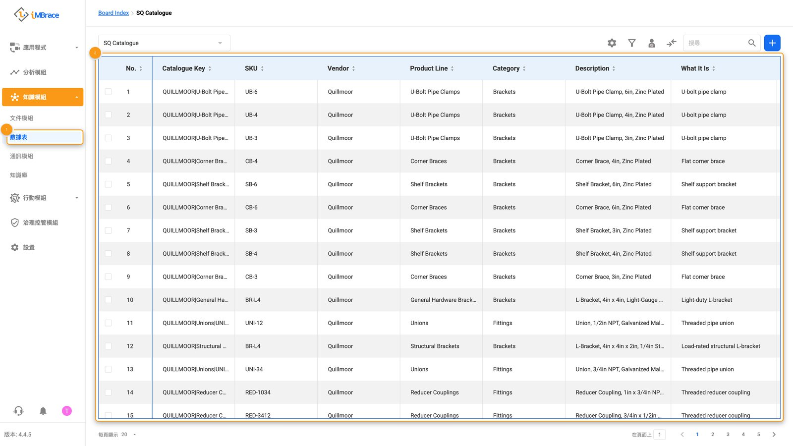
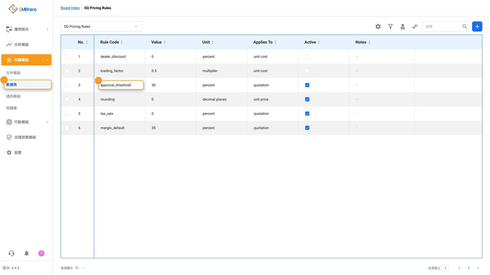
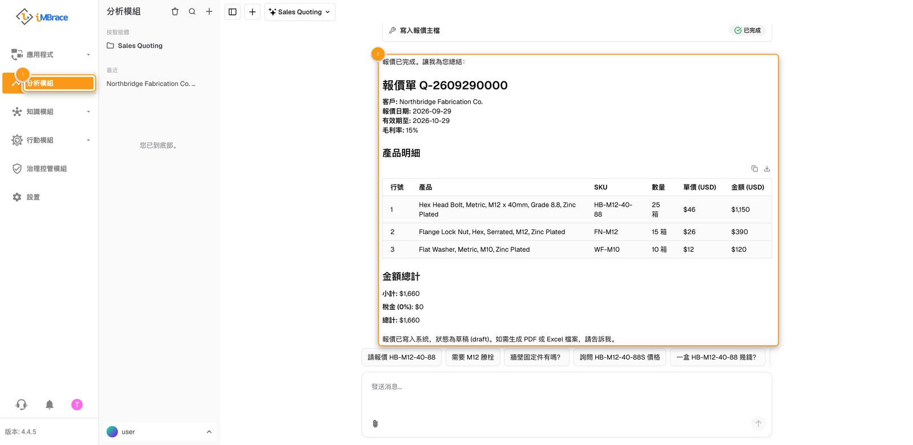
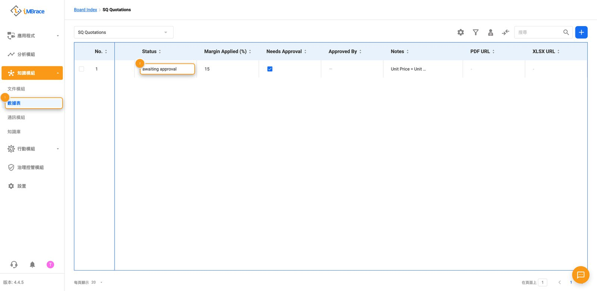
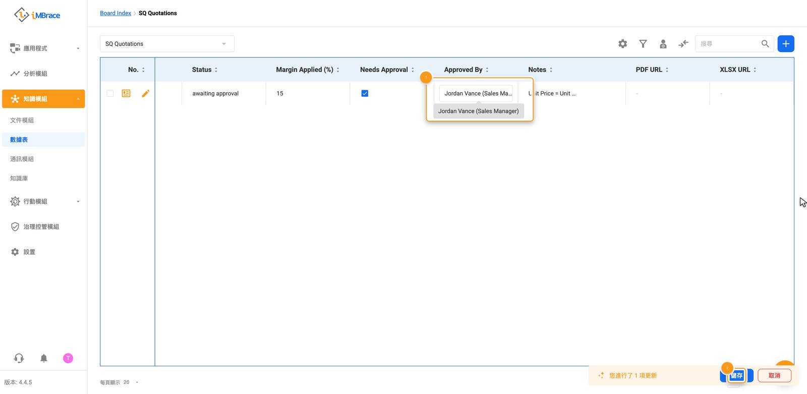
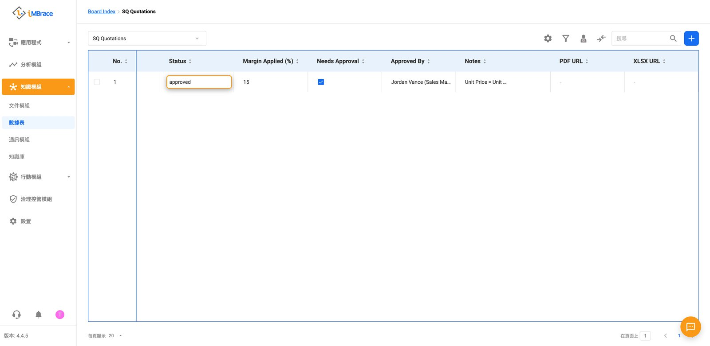
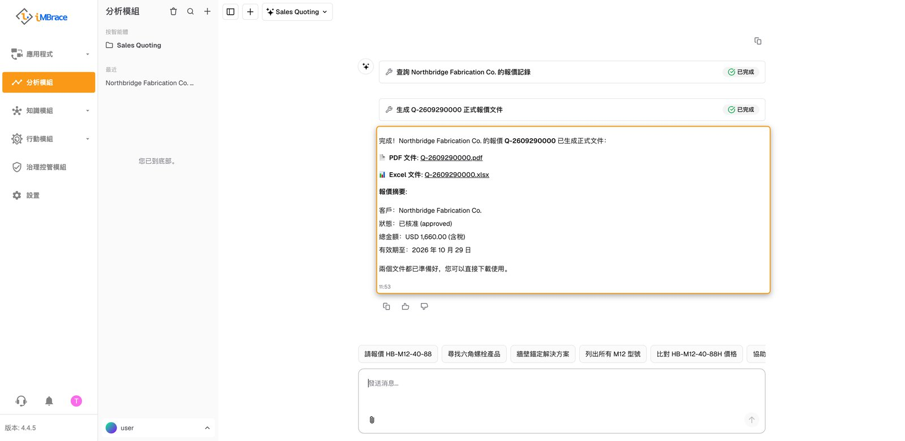

Quillmoor Components 的業務團隊依照一份龐大的目錄，為工業用緊固件與配件報價，任何超出標準規則的折扣，都需要先經過主管核准才能送出。iMBrace 能把一句白話的請求，直接轉換成一份已定價的報價，並且只有在正確的人核准所有超出規則的部分之後，才會讓報價轉為最終版本。

## 整個流程，一步一步來

以下是完整的故事，從頭到尾：

1. 業務人員會用白話向這個名為 Sales Quoting 的代理人提出報價請求：說明客戶、產品與數量。
2. 這個代理人會讀取 SQ Catalogue 和 SQ Pricing Rules 這兩張「數據表」（DataIQ），裡面存放 Quillmoor 的產品資料與定價規則。

1　「知識模組」（Knowledge）>「數據表」（DataIQ）。2　「SQ Catalogue」數據表，Quillmoor 的產品與價格。

1　「知識模組」（Knowledge）>「數據表」（DataIQ）。2　折扣規則列，在「approval_threshold」欄位。

3. 它會算出報價內容，並逐行寫入 SQ Quotations 和 SQ Quotation Lines 這兩張數據表。

1　側邊欄的「分析模組」（InsightsIQ）。2　Sales Quoting 代理人的回覆：逐行定價的新報價單。

4. 當要求的折扣超出 SQ Pricing Rules 數據表上的規則時，報價的狀態就會顯示為等待主管處理——這是平台自己攔下來的，不是代理人自行決定的。

1　「知識模組」（Knowledge）>「數據表」（DataIQ）。2　報價單自身的狀態：awaiting approval（待核准）。

5. 主管會直接在數據表上檢視並核准。

1　「Approved By」欄位，正在輸入主管姓名。2　「儲存」（Save）按鈕。

6. 一項工作流——iMBrace 用來執行一經觸發就會自行接續的步驟——會自動偵測到這項核准，並把報價標記為最終版本。業務人員接著會向代理人索取這份完成的報價文件，準備寄出。

報價單的狀態已自動轉為 approved（已核准）。

Sales Quoting 代理人的回覆：完成的報價單編號，附 PDF 與 XLSX 下載連結。

## 人在哪裡做決定

要求折扣超出標準規則的報價，必須等主管核准後才能轉為最終版本。這個步驟之所以存在，是因為規則本身不允許的折扣，理應永遠由人來決定——而且每一次都由 iMBrace 本身以同樣的方式檢查，而不是靠記憶。

## 不用寫程式就能調整的內容

折扣所依據的檢查規則，以及 Quillmoor 販售的所有品項，都是數據表上的一列資料。

| 資料列 | 控制的內容 |
|---|---|
| SQ Pricing Rules 數據表上的每一條規則 | Quillmoor 期望的利潤，以及需要主管核准的折扣等級。 |
| SQ Catalogue 數據表上的每一項產品 | Quillmoor 販售的品項，以及對應的價格。 |
| SQ Terms 數據表上的每一行 | 每份報價上都會出現的文字，例如有效期限、交貨與付款條件。 |

更改一列資料，下一份寫出的報價就會套用這項更新——不需要重新建置。

## 動手試試看

如果你是合作夥伴，你的練習組織一開始就已經安裝好 Sales Quoting，並使用 Quillmoor Components 的目錄與定價規則；你的合作夥伴工具包中的示範腳本則會帶你完整跑一遍實際操作，從第一次請求，到主管核准，再到完成的報價。其他人則可以請自己的 iMBrace 聯絡窗口，在屬於自己的組織上展示它的運作情形。
